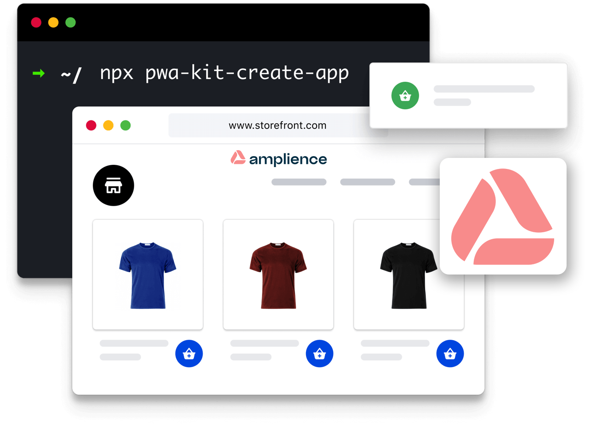

<div align="center">
<h1>The Progressive Web App (PWA) Kit with Amplience</h1>
</div>

[🏖️ View Amplience Demo](https://ascc-production.mobify-storefront.com/)

The Amplience PWA Kit is a storefront technology for headless commerce using [Amplience APIs](https://amplience.com/docs/integration/reference.html), Salesforce Commerce APIs and React. It provides front-end developers with a more flexible and agile approach to build and maintain modern eCommerce experiences with the use of [Amplience](https://amplience.com/)



___

# Amplience specifics
This is a version of the Retail React app with a starting point for Amplience fundamentals. The documentation below is 'as-is' from Salesforce. For Amplience specifics please see the following.

> Note: This code is built against the code version @latest at the time which was PWAKit v2.1.0 released on July 5th 2022: https://github.com/SalesforceCommerceCloud/pwa-kit/releases/tag/v2.1.0

## Amplience Contents
* [Overview](./docs/amplience/overview.md)
* [Salesforce Commerce Cloud Setup](./docs/amplience/sfcc-setup.md)
* [Security Updates](./docs/amplience/security-updates.md) 
* [Amplience API](./docs/amplience/amplience-api.md)
* [Amplience Components List](./docs/amplience/amplience-components-list.md)
* [Navigation](./docs/amplience/navigation.md)
* [AmplienceWrapper Component](./docs/amplience/ampliencewrapper-component.md)
* [Visualization](docs/amplience/visualization.md)
* [Preview](docs/amplience/preview.md)
* [Amplience Account](docs/amplience/amplience-account.md)
* [Automation](docs/amplience/automation.md)  


# The Retail React App

The Retail React App is an isomorphic JavaScript storefront and [Progressive Web App](https://developer.mozilla.org/en-US/docs/Web/Progressive_web_apps) built using [React](https://reactjs.org/) and [Express](https://expressjs.com/). It uses a modern headless architecture that enables developers to decouple front-end code from back-end systems. It leverages popular open-source libraries in the React ecosystem, such as [Chakra UI](https://chakra-ui.com/) components, [Emotion](https://emotion.sh/docs/introduction) (CSS-in-JS), [Webpack](https://webpack.js.org/), and many more.

Developers don’t have to worry about the underlying infrastructure, whether they’re developing their app locally, deploying it to a [Managed Runtime](https://developer.salesforce.com/docs/commerce/pwa-kit-managed-runtime/guide/mrt-overview.html) environment, or testing the app live.

## Requirements

-   Node 14
-   npm 6.14.4 or later

## Getting Started

To start your web server for local development, run the following command in your project directory:

```bash
npm start
```

Now that the development server is running, you can open a browser and preview your commerce app:

-   Go to http://localhost:3000/

## Localization

See the [Localization README.md](./app/translations/README.md) for important setup instructions for localization.

## Configuration Files

The Retail React App's configuration files are located in the `app/config` folder. For more details, see [Configuration Files](https://developer.salesforce.com/docs/commerce/pwa-kit-managed-runtime/guide/configuration-options.html) in the documentation.

## Documentation

The full documentation for PWA Kit is hosted on the [Salesforce Developers](https://developer.salesforce.com/docs/commerce/pwa-kit-managed-runtime/overview) portal.

### Useful Links:

-   [Getting Started](https://developer.salesforce.com/docs/commerce/pwa-kit-managed-runtime/guide/getting-started.html)
-   [Setting Up API Access](https://developer.salesforce.com/docs/commerce/pwa-kit-managed-runtime/guide/setting-up-api-access.html)
-   [Configuration Files](https://developer.salesforce.com/docs/commerce/pwa-kit-managed-runtime/guide/configuration-options.html)
-   [Pushing and Deploying Bundles](https://developer.salesforce.com/docs/commerce/pwa-kit-managed-runtime/guide/pushing-and-deploying-bundles.html)
-   [The Retail React App](https://developer.salesforce.com/docs/commerce/pwa-kit-managed-runtime/guide/retail-react-app.html)
-   [Proxying Requests](https://developer.salesforce.com/docs/commerce/pwa-kit-managed-runtime/guide/proxying-requests.html)
