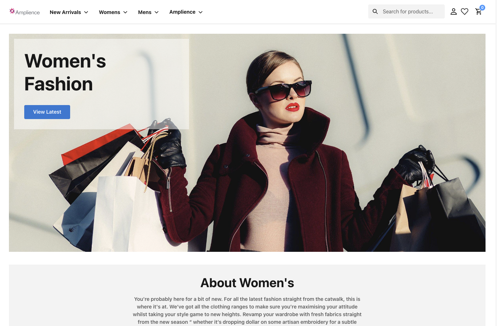

<div align="center">
<h1>Amplience Salesforce Composable Commerce</h1>
</div>

[🏖️ View Amplience Demo](https://ascc-production.mobify-storefront.com/)

The ***A***mplience ***S***alesforce ***C***omposable ***C***ommerce app is a storefront technology for headless commerce using [Amplience APIs](https://amplience.com/docs/integration/reference.html), Salesforce Commerce and OCAPI APIs, and React. It provides front-end developers with a more flexible and agile approach to build and maintain modern eCommerce experiences with the use of [Amplience](https://amplience.com/).



___

# Amplience Specifics

This version of the SF Retail React app integrates Amplience as the Content CMS to:
 - drive all site content, PLP in-grid content, site navigation, product page content and footer links
 - shoppable content components for rich media like images and video
 - schedule & preview all content
 - real-time visualisation of all content
 - real-time visualisation of content sizing & placement ***within*** product listing grids
 - content personalisation based on a user's groups
 - enhanced search suggestions and search results page with content, products and category parents
 - automation scripts to load required content schemas and types to your Content HUB 
 
 The documentation [starting here below](#the-retail-react-app) is 'as-is' from Salesforce. For Amplience specifics please see the docs listed under [Amplience Contents](#amplience-contents).
 
## Amplience Contents
### 🏁 Quick Start
* [Getting Started](./docs/amplience/getting-started.md)
* [SFCC Setup for Amplience](./docs/amplience/sfcc-setup.md)
* [Security Updates](./docs/amplience/security-updates.md) 

### ⚙️ Core Functionalities
* [Amplience Configuration](./docs/amplience/amplience-config.md)
* [Amplience API](./docs/amplience/amplience-api.md)
* [Visualization](docs/amplience/visualization.md)
* [Preview](docs/amplience/preview.md)
* [Amplience Account](docs/amplience/amplience-account.md)
* [Automation](docs/amplience/automation.md)

### 👥 Experience Management
* [Navigation](./docs/amplience/navigation.md)
* [Product Listing Page (PLP) Management](./docs/amplience/product-listing-page-management.md)
* [Product Details Page (PDP) Management](./docs/amplience/product-details-page-management.md)
* [Personalisation (Customer Groups)](docs/amplience/personalisation.md)
* [Global Site Search](./docs/amplience/global-site-search.md)

### 🧩 Components & Extensions
* [Amplience Extensions List](./docs/amplience/amplience-extensions-list.md)
* [Amplience Components List](./docs/amplience/amplience-components-list.md)
  * [AmplienceWrapper Component specifics](./docs/amplience/ampliencewrapper-component.md)
  * [Shoppable Image specifics](docs/amplience/shoppable-image-component.md)
  * [Shoppable Video specifics](docs/amplience/shoppable-video-component.md)
* [Toolbar Framework](docs/amplience/toolbar-framework.md)

> Note: This code is built against the code version @latest at the time which was PWAKit v2.3.0 released on November 7th 2022: https://github.com/SalesforceCommerceCloud/pwa-kit/releases/tag/v2.3.0

If you are using an earlier version, please consider upgrading your codebase to match this by either using this as a basis or following the same upgrade path as can be found here: https://developer.salesforce.com/docs/commerce/pwa-kit-managed-runtime/guide/upgrade-to-v2-3.html

## Known Limitations

### Localisation
By default we point to the same SFCC instance as the vanilla Retail React app. If you are pointing to your own SFCC sandbox, you should ensure that you have localisation enabled. See guide at [Localization README.md](./app/translations/README.md), [Overview](./docs/amplience/getting-started.md) and  [Salesforce Commerce Cloud Setup](./docs/amplience/sfcc-setup.md).

### Customer Groups API & Content Personalisation
There is currently no 'out of the box' API available that enables you to see which customer groups a user is associated to for Content Personalisation. To enable Content Personalisation on your own sandbox, please follow the steps to install our cartridge which enables a hook to get the required information via OCAPI.

Please ensure that your SFCC sandbox has the [Amplience Hooks Bridge Cartridge](https://github.com/amplience/amplience-sfcc-hooksbridge) installed with the correct OCAPI permissions as per the documentation.

> Note: When the Salesforce [Shopper Context API](https://developer.salesforce.com/docs/commerce/commerce-api/references/shopper-context) is out of BETA, the code examples may change to make use of this API.

# The Retail React App

The Retail React App is a project template that includes an isomorphic JavaScript storefront and [Progressive Web App](https://developer.mozilla.org/en-US/docs/Web/Progressive_web_apps) built using [React](https://reactjs.org/) and [Express](https://expressjs.com/). It uses a modern headless architecture that enables developers to decouple front-end code from back-end systems. It leverages popular open-source libraries in the React ecosystem, such as [Chakra UI](https://chakra-ui.com/) components, [Emotion](https://emotion.sh/docs/introduction) (CSS-in-JS), [Webpack](https://webpack.js.org/), and many more.

Developers don’t have to worry about the underlying infrastructure, whether they’re developing their app locally, deploying it to a [Managed Runtime](https://developer.salesforce.com/docs/commerce/pwa-kit-managed-runtime/guide/mrt-overview.html) environment, or testing the app live.

## Requirements

-   Node 14.17.0 or later
-   npm 6.14.4 or later

## Get Started

To start your web server for local development, run the following command in your project directory:

```bash
npm start
```

Now that the development server is running, you can open a browser and preview your commerce app and go to http://localhost:3000.

## Localization

See the [Localization README.md](./app/translations/README.md) for important setup instructions for localization.

## Configuration Files

The Retail React App's configuration files are located in the `app/config` folder. For more details, see [Configuration Files](https://developer.salesforce.com/docs/commerce/pwa-kit-managed-runtime/guide/configuration-options.html) in the documentation.

## Documentation

The full documentation for PWA Kit and Managed Runtime is hosted on the [Salesforce Developers](https://developer.salesforce.com/docs/commerce/pwa-kit-managed-runtime/overview) portal.

### Useful Links:

-   [Get Started](https://developer.salesforce.com/docs/commerce/pwa-kit-managed-runtime/guide/getting-started.html)
-   [Skills for Success](https://developer.salesforce.com/docs/commerce/pwa-kit-managed-runtime/guide/skills-for-success.html)
-   [Set Up API Access](https://developer.salesforce.com/docs/commerce/pwa-kit-managed-runtime/guide/setting-up-api-access.html)
-   [Configuration Options](https://developer.salesforce.com/docs/commerce/pwa-kit-managed-runtime/guide/configuration-options.html)
-   [Proxy Requests](https://developer.salesforce.com/docs/commerce/pwa-kit-managed-runtime/guide/proxying-requests.html)
-   [Push and Deploy Bundles](https://developer.salesforce.com/docs/commerce/pwa-kit-managed-runtime/guide/pushing-and-deploying-bundles.html)
-   [The Retail React App](https://developer.salesforce.com/docs/commerce/pwa-kit-managed-runtime/guide/retail-react-app.html)
-   [Rendering](https://developer.salesforce.com/docs/commerce/pwa-kit-managed-runtime/guide/rendering.html)
-   [Routing](https://developer.salesforce.com/docs/commerce/pwa-kit-managed-runtime/guide/routing.html)
-   [Phased Headless Rollouts](https://developer.salesforce.com/docs/commerce/pwa-kit-managed-runtime/guide/phased-headless-rollouts.html)
-   [Launch Your Storefront](https://developer.salesforce.com/docs/commerce/pwa-kit-managed-runtime/guide/launching-your-storefront.html)
