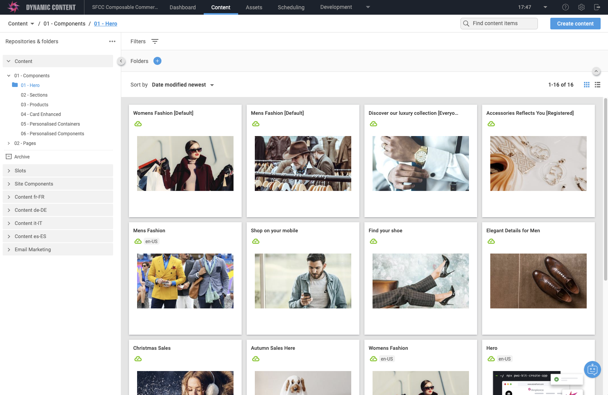

# Amplience Account pre-requisites

## Recommended account provisioning
If you are an Amplience Customer / Partner and have access to the Amplience support desk we recommend that you use the [Demo Store Core Provisioning Ticket Item](https://support.amplience.com/support/catalog/items/118) as all of the requirements below are already part of the process.

## General pre-requisites
* You must have [Content Delivery 2](https://amplience.com/docs/development/contentdelivery/readme.html) enabled.

## Automation pre-requisites
In order to automate content into your account, the files are setup to work with a certain account configuration.

* Repositories
    * Must have a content repository with name `content`
    * Must have a slots respository with name `slots`
    * Must have a content respository with name `sitestructure`
* API Client
    * Your API client must have `customer admin` permissions
    * Your API client must have have `DAM API` permissions to access your Content Hub.
