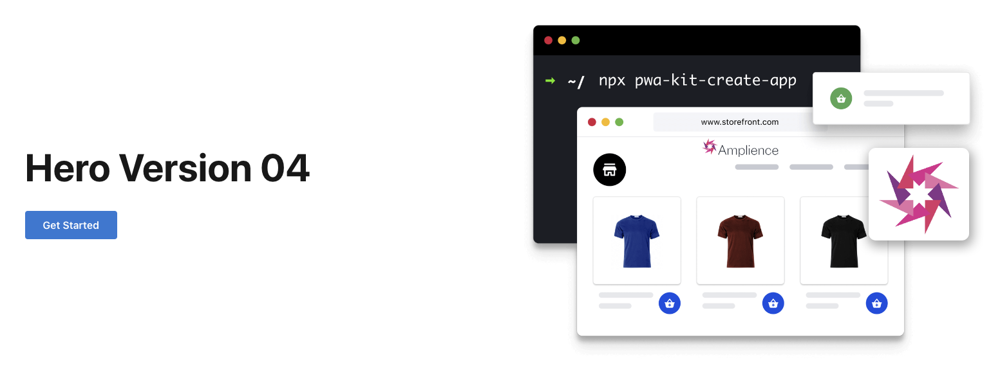
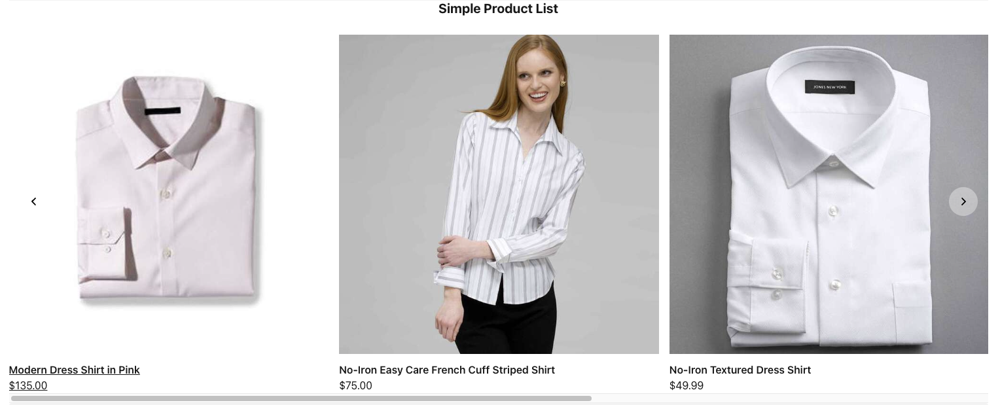

# Amplience Components List

| Schema Id | React Component in `/app/components/amplience` | Description |
|-----------|-----------------|-------------|
| https://sfcc.com/components/hero | `./hero/Hero` |  Hero banner with an image, a localised title and a list of localised actions |
| https://sfcc.com/components/section | `./section/Section` |  A block of text with a localised title and localised subtitle|
| https://sfcc.com/components/card-enhanced | `./card-enhanced/CardEnhanced` |  An enhanced card with localisation, responsive imaging, point of interest cropping and layout options|
| https://sfcc.com/components/curated-product | `./curated-product-list/CuratedProductList` |  A list of manually curated products from SFCC |
| https://sfcc.com/components/personalised-container | `./personalised-container/PersonalisedContainer` | A container that contains variants associated to customer groups to display personalised content |
| https://sfcc.com/components/personalised-component | `./personalised-component/PersonalisedComponent` | A component that contains variants associated to customer groups to display personalised content |
| https://sfcc.com/slots/flexible-list | `./flexibleListSlot/flexibleListSlot` | A slot that contains a flexible list of content |
| https://sfcc.com/slots/personalised-slot | `./personalised-slot/PersonalisedComponent` | A slot that contains variants associated to customer groups to display personalised content |

 
