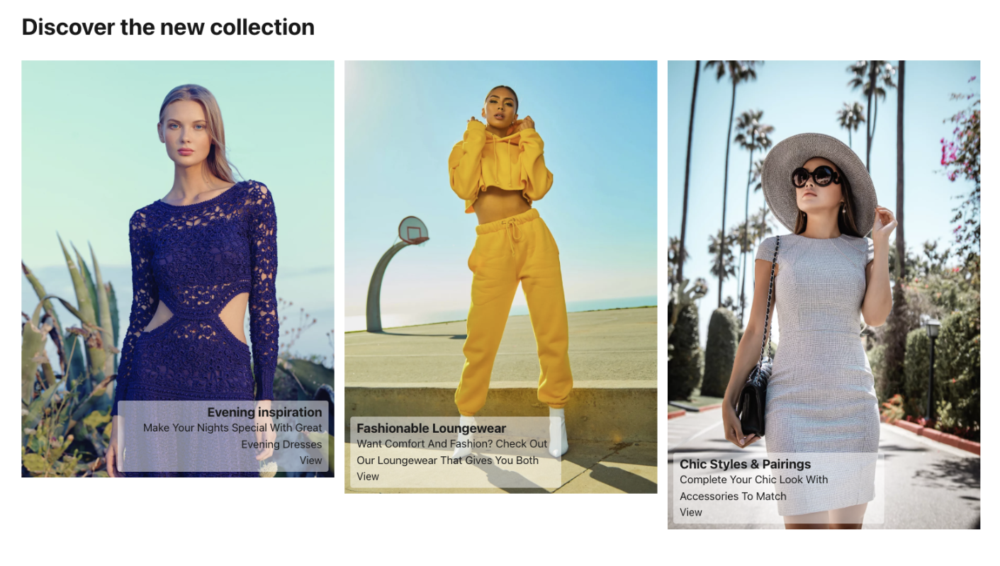
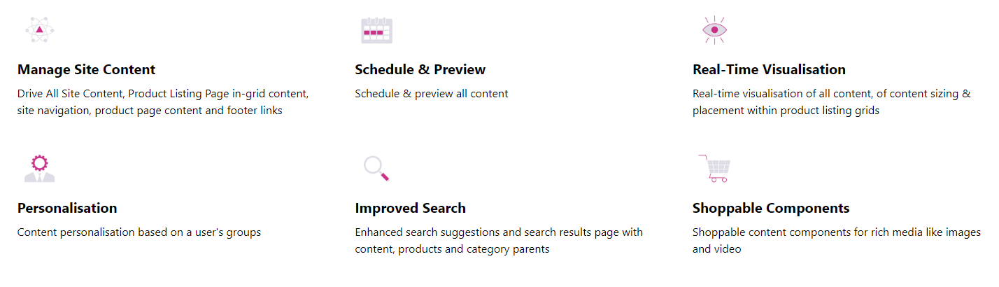
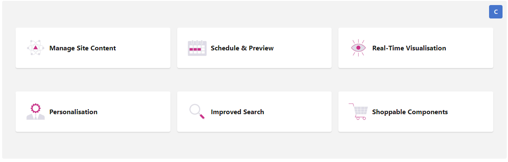
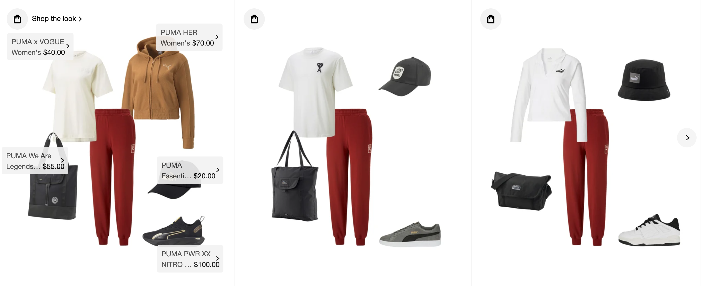
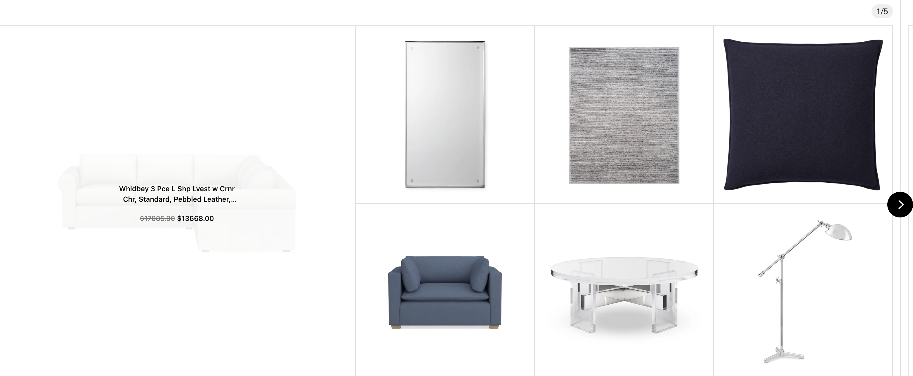
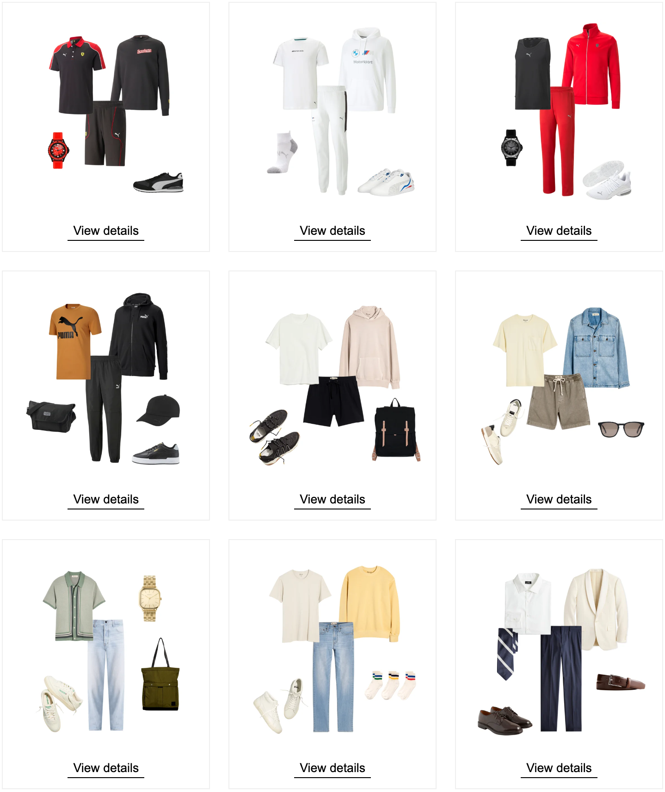
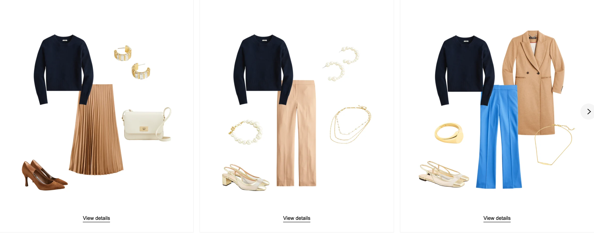
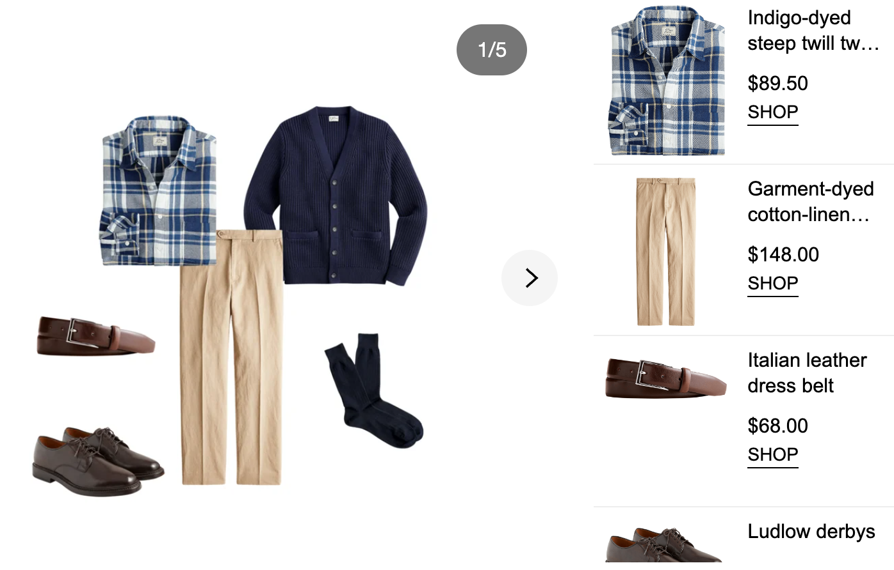
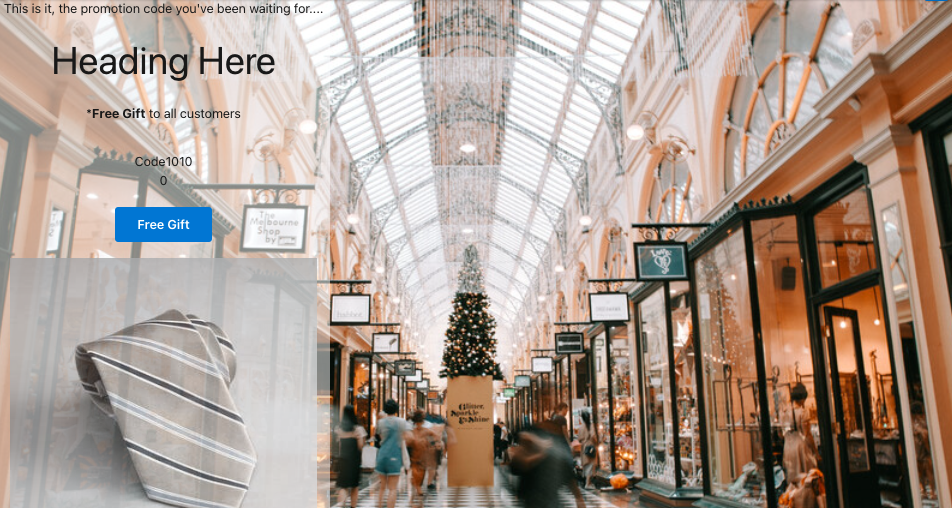
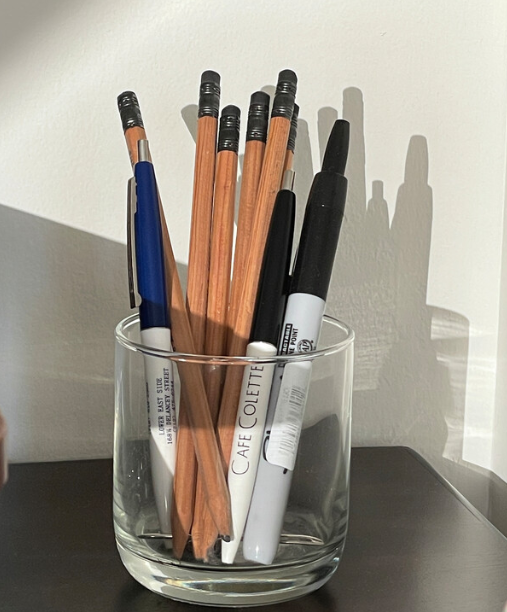

# Amplience Components List

| Schema Id | React Component in `/app/components/amplience` | Description |
|-----------|-----------------|-------------|
| https://sfcc.com/components/card-enhanced | `./card-enhanced/CardEnhanced` |  An enhanced card with localisation, responsive imaging, point of interest cropping and layout options|
| https://sfcc.com/components/card-list | `./card-list/CardList` |  Displaying a list of Card Enhanced in an horizontal stack |
| https://sfcc.com/components/curated-product | `./curated-product-list/CuratedProductList` |  A list of manually curated products from SFCC |
| https://sfcc.com/components/features | `./features/Features` |   Component displaying a list of features (icon, title, text, link) with two possible views, listing or buttons. This shows an example if choosing renders via CMS content and automated alt text for images in a fallback from other values |
| https://sfcc.com/components/hero | `./hero/Hero` |  Hero banner with an image, a localised title and a list of localised actions |
| https://sfcc.com/components/personalised-component | `./personalised-component/PersonalisedComponent` | A component that contains variants associated to customer groups to display personalised content |
| https://sfcc.com/components/personalised-container | `./personalised-container/PersonalisedContainer` | A container that contains variants associated to customer groups to display personalised content |
| https://sfcc.com/components/personalised-ingrid-component | `./personalised-component/PersonalisedComponent` | A component that contains variants associated to customer groups to display personalised content, but only for grid items |
| https://sfcc.com/components/personalised-experience | `./personalised-experience/PersonalisedExperience` | A wrapper that allows any content to be associated to segment, category, define is the experience is active or not to delivery content dynamically |
| https://sfcc.com/components/personalised-experiences-list | `./personalised-experiences-list/PersonalisedExperiencesList` | A container that lets user configure the criteria to dynamically load in `personalisedExperience` content |
| https://sfcc.com/components/rich-text| `./rich-text/RichText` | Component using the dc-extension-rich-text with Markdown and visual editing |
| https://sfcc.com/components/section | `./section/Section` |  A block of text with a localised title and localised subtitle|
| https://sfcc.com/components/shoppable-image | `./shoppable-image/ShoppableImage` | A component that allows the merchandizer to add hotspot links to an image. Links may point to Commerce products & catagories, as well as simple tooltips and external URLs.  |
| https://sfcc.com/components/shoppable-video | `./shoppable-video/ShoppableVideo` | A component that allows the merchandizer to add hotspot links to a video. Links may point to Commerce products & catagories, as well as simple tooltips and external URLs.  |
| https://sfcc.com/content/stylitics/generic           | `./stylitics`              |  Can render all stylitics widgets from a single content type with all available options |
| https://sfcc.com/content/stylitics/hotspots            | `./stylitics`             |  Only options for a Stylitics Hotspot Widget |
| https://sfcc.com/content/stylitics/moodboard           | `./stylitics`             |  Only options for a Stylitics Moodboard Widget |
| https://sfcc.com/content/stylitics/gallery            | `./stylitics`            |  Only options for a Stylitics Gallery Widget |
| https://sfcc.com/content/stylitics/classic            | `./stylitics`            |  Only options for a Stylitics Classic Widget |
| https://sfcc.com/content/stylitics/main-and-detail            | `./stylitics`             |  Only options for a Stylitics Main & Detail Widget |
| https://sfcc.com/slots/flexible-list | `./flexibleListSlot/flexibleListSlot` | A slot that contains a flexible list of content |
| https://sfcc.com/slots/personalised-slot | `./personalised-slot/PersonalisedComponent` | A slot that contains variants associated to customer groups to display personalised content |
| https://sfcc.com/slots/localised-slot | `./localised-slot/LocalisedSlot` | A slot that contains variants associated different locales to support content item level localisation |
| https://sfcc.com/components/promo-bynder| `./promo-bynder/PromoBynder`  | A Promotional Item with Bynder asset |
|https://sfcc.com/components/banner-bynder| `./banner-bynder/BannerBynder`  | A single reference to an item in Bynder with file selection |
|https://sfcc.com/components/banner| `./banner/Banner`  | A single reference to an item with file selection |
| https://sfcc.com/components/promo| `./promo/Promo`  | A Promotional Item |
