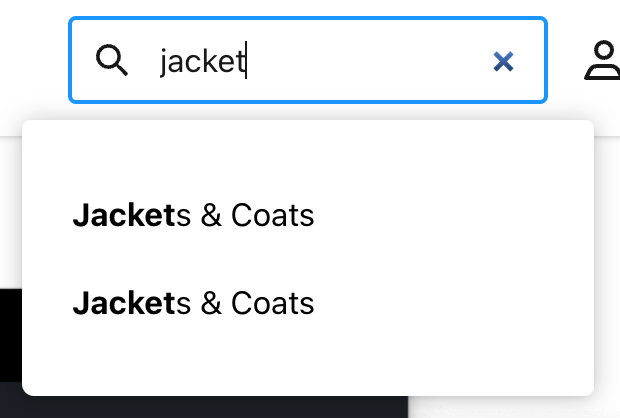
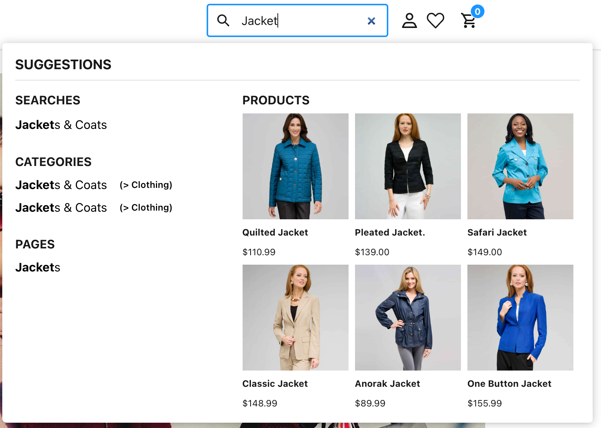
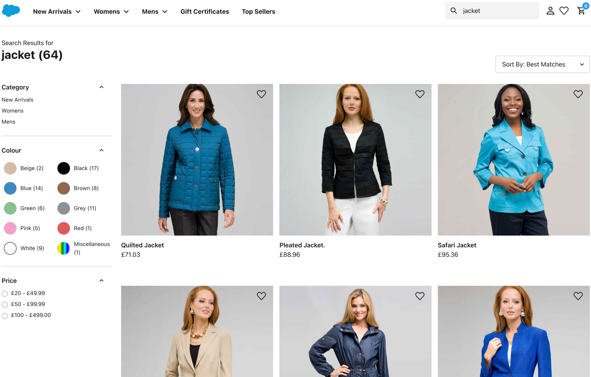
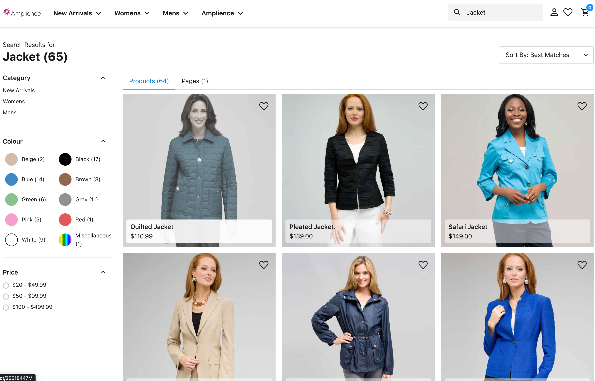
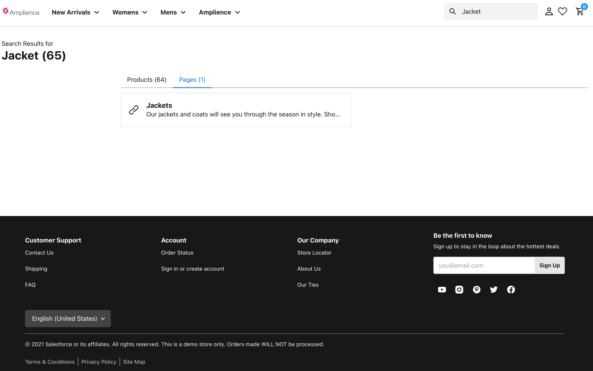

# Global Site Search

A good global site search presents the user with relevant suggestions in order to complete their mission. This is not just related to products categories, but also products and content. See details below how this is achieved:

- [Search Bar (Type ahead suggections)](#search-bar-type-ahead-suggestions)
- [Search Results Page (SRP)](#search-results-page-srp)
- [Global Architecture Decisions](#global-architecture-decisions)

## Search Bar (Type ahead suggestions)
The default search bar displays matching categories from the SFCC catalog.

The Amplience search bar shows all suggestions (Categories, Products & Content Pages)

### Improvements
- Displays parent category information to avoid ambiguity
- Uses the productSuggestions API to get products relevant for the search term
- Displays content pages with localised text search

### Rules
- Category Display
    - Will only display parent category information if the parent is not a **root** category
- Products
    - Will display up to 6 products to avoid UX issues on Desktop / Mobile 
- Pages
    - Will display up to 4 content pages to avoid UX issues on Desktop / Mobile

## Search Results Page (SRP)
The default search results page only displays products from the SFCC catalog:

The Amplience search results page combines both products and content pages into tabs.

Below is an illustration of pages matching 'jackets'

### Improvements
- Tabbed Display between products and pages

### Rules
- Products displayed use the productSearch API.
- Only pages marked as 'active' will display
- The pages displayed match the localised text search in alphabetical order
- Will display unlimited pages

## Global Architecture decisions

- Filter API to get all pages
- Text matching ordering is done in the application via the page title, description and keywords. 

These are achieved by calling `getSearchableContentPages` in `docs/amplience/amplience-api.md`. The matches prioritise in the following order:
1) Title
2) Keywords
3) Description

- Any links maintain locale and VSE information.

All links use the `useNavigation` hook found in `app/hooks/use-navigation.js`

> Note: Future releases will include content from [Amplience Search](https://amplience.com/developers/docs/integrations/search/)