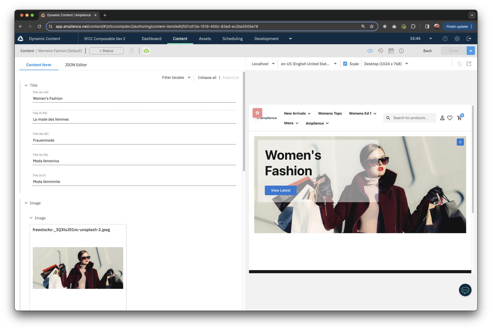
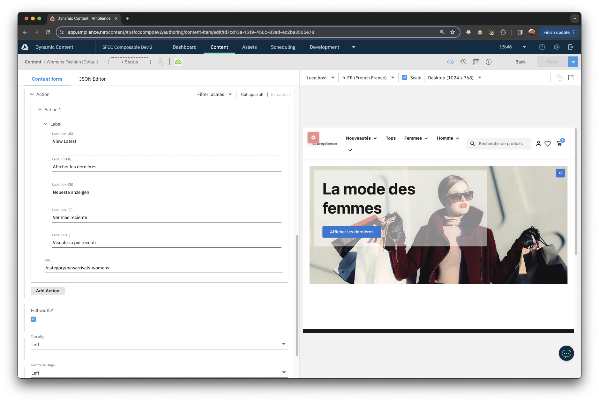
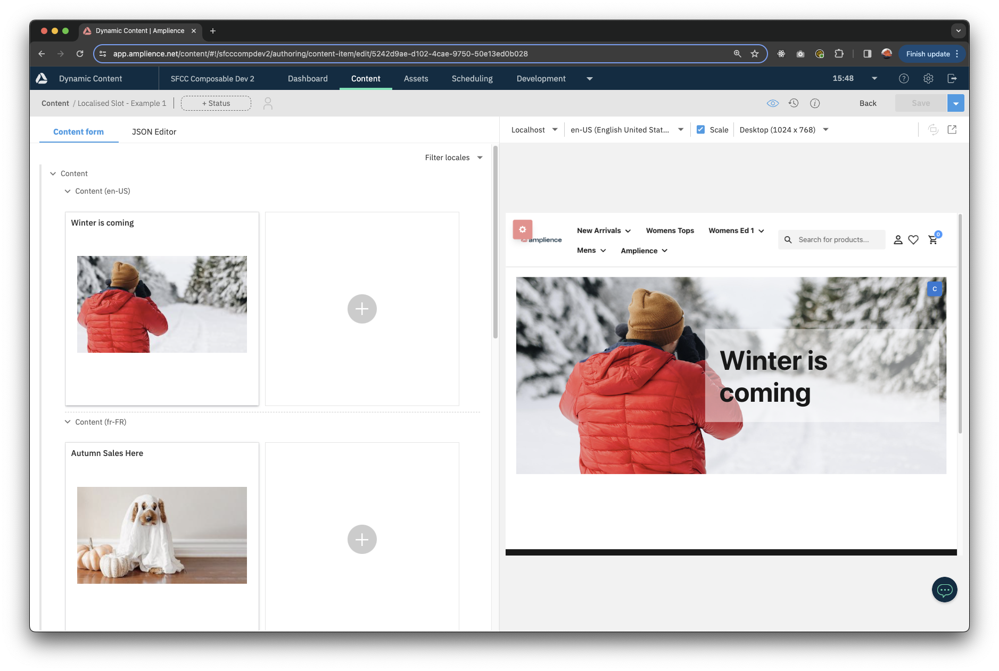
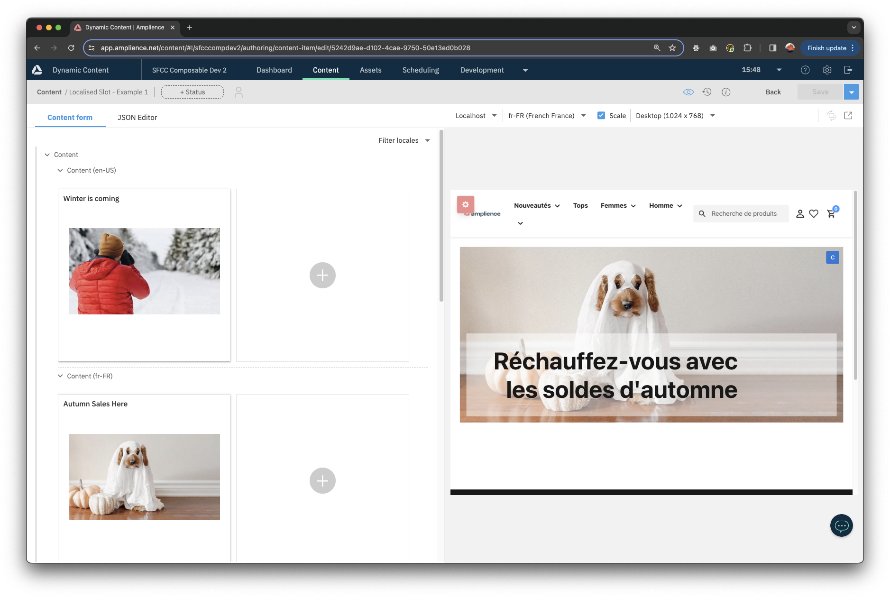

# Localisation

Amplience has extensive localisation capabilities that allow you to map your localisation requirements and organisation to your content management processes.

[Localisation Overview](https://amplience.com/developers/docs/user-guides/produce-content/localize/)
[Localisation Developer Guide](https://amplience.com/developers/docs/dev-tools/guides-tutorials/localization/)

This application uses a mixture of field level and item level localisation to illustrate how these approaches work both technically and in a demonstration.

All localised content is fetched from the Amplience APIs using the [Delivery SDK](https://github.com/amplience/dc-delivery-sdk-js) and adheres to the site locale.

## Field Level localisation

Most components in this application have field level localisation. This enables teams to input all localised content in a single content item which is useful when there are no differences in scheduling for different locales.

The following screenshots show visualisation of different locales:

## Item Level localisation

To illustrate item level localisation, this application has a 'Localised Slot'.

This enables teams to schedule different content for different locales.

