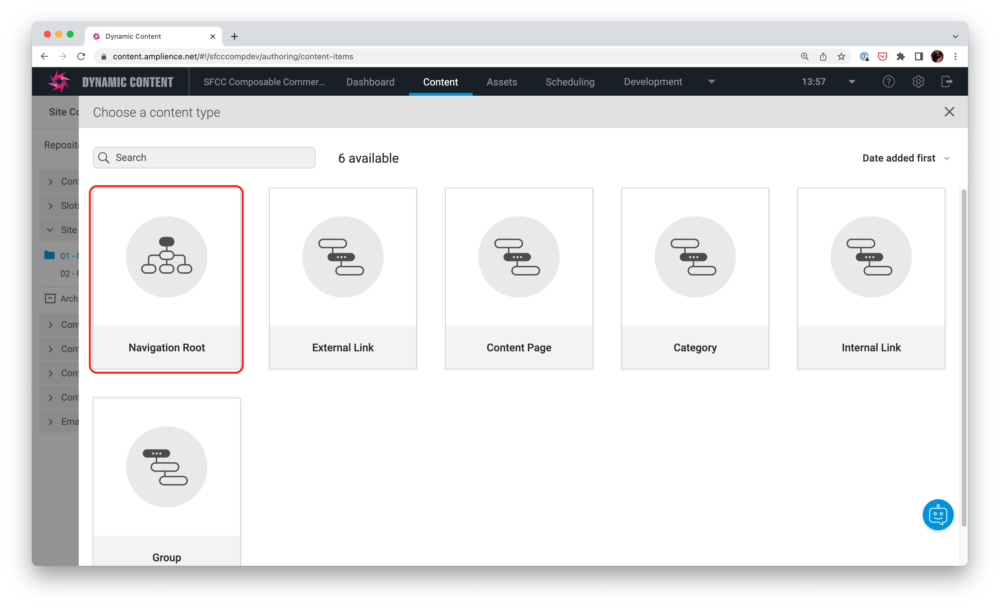
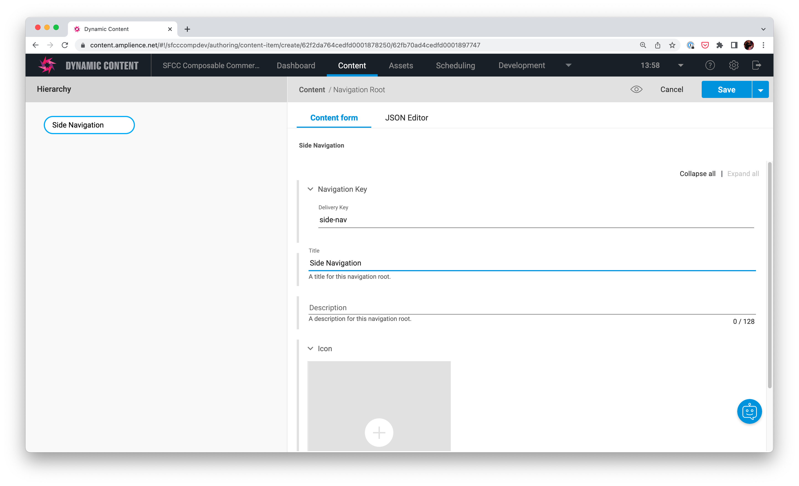

# Navigation

## Context
Navigation by the default Salesforce Composable Commerce Front-End (PWA Kit) is driven by 2 methods:
1. Hard coded items in the front end code
2. By product catalog categories via the API

Other types of navigation (for example footer links) are purely hard coded both for mobile and desktop menus.

In this example, we show how Amplience can be used to put control in the hands of business teams to manage any type of navigation. This involves:

* Any type of navigation. Examples for both header and footer
* Drawing mobile / desktop versions from the same data source
* Being able to define what type of navigation entry you like
* Uses content types to manage different node types in navigation. See [here](./amplience-components-list.md)
* Seamlessly link to a category for a navigation item
* Localised content and values for each item

## Amplience Specifics

This example uses the [Amplience Hierarchies](https://amplience.com/docs/development/hierarchies/readme.html) and the [Amplience Filter API](https://amplience.com/docs/development/contentdelivery/filterapiintro.html#introducing-the-filter-api) to manage the navigation content for both the Main navigation and the footer navigation.

The root of each navigation item has its own [delivery key](https://amplience.com/docs/development/delivery-keys/readme.html) so that the Front-End application knows consistently what to call.

See `app/components/_app/index.jsx` for how the hierarchy information is fetched and passed to components to render.

For the desktop we use the `AmplienceListMenu` component passing in the properties and for the footer we use use the `DrawerMenu` component.

> Note: Where we have changed the default SFCC Composable Commerce FE components to render from data, you will find them in `app/components/amplience`. We have also kept the originals in `app/components` if it is useful to refer to them or use them in other areas of the application.

## Example Navigation

When you [automate](./automation.md) content for this sample application into your Amplience Hub, you have working examples of both the header and footer navigation.

Links in the content tab are as follows:

| Navigation | Folder | Delivery Key |
|------------|--------|--------------|
| Header     | `Site Components\01 Main Navigation\Main Navigation`| `main-nav` |
| Footer | `Site Components\02 Footer\Footer Navigation` | `footer-nav` |

 These contain example node structures to drive each of the navigation options in the Front-End.

### Navigation Content Types
The navigation is build up of nodes of different types. Below is a brief description of what they are.

* **Root**: Contains the delivery key for the FE application to load the navigation content. It also has fields used internally to display friendly cards. The Image field when used in the Main navigation also changes the icon for the FE application
* **Group**: Non clickable navigation item used to group children for ease of navigation for the consumer.
* **Category**: Contains the [eComm Toolkit Extension](https://github.com/amplience/dc-extension-ecomm-toolkit) to allow users to link to a category in Saleforce Commerce Cloud. It also has advanced functionality which allow you to:
*  'Automatically' append sub categories directly from Salesforce Commerce Cloud without having to re-make in Amplience.
* If you have no title, it will draw the title from the correct locale from the Salesforce Commerce Cloud Category
* **Content Page**: allows you to select a `content page` from your content library. Clicking on the link will go directly to the page.
* **External link**: allows localised link values with should be full URLs. External links will open in a new window.
* **Internal**: allows localised link values with should be relative paths. Internal links will open in the same window.

### Global (Navigation Partial)

Each apart from root node allows you to:
* **Visible**: defaults to `true`. Deselect if you do not want the item to be visible
* **Title**: localised option for the title of the navigation item with fallback rules.
* **Priority**: the order of the items, lower items come first.
* **Navigation Content**: displays content in the mega menu. See the `New Arrivals` node for an example in `Main Navigation`

### Visualising Navigation

When visualising navigation you have 4 options:
1. **Default**: displays the FE nav as it is set in the FE (Header is header and footer is footer 😀)
2. **Header**: ensures both FE experiences (Footer and Main Nav) load the Header content
3. **Footer**: ensures both FE experiences (Footer and Main Nav) load the Footer content
4. **JSON**: the JSON content for the node

The default visualisations are different per node:

* **Root**: Point to the homepage
* **Group**: Points to just a visualisation with no content
* **Category**: Point to the category page
* **Content Page**: Points to just a visualisation with no content
* **External link**: Points to just a visualisation with no content
* **Internal**: Points to just a visualisation with no content

> Note: For a Content page, to see the content simply select the menu item in the visualisation. Alternatively open the content type

## Building a custom navigation hierarchy

Besides `main-nav` and `footer-nav`, you can create your own custom hierarchies.

### Create the hierarchy in Amplience

In `Site Components`, select 'Create Content'.

Create a Navigation Root.

Give it a name (`Side Navigation`) and a unique Delivery Key (`side-nav`).

Build your hierarchy by creating nodes. Refer [here](https://github.com/amplience/amplience-sfcc-composable-commerce/blob/main/docs/amplience/navigation.md#navigation-content-types) for navigation content types.

### Wire the hierarchy into the app

## Removing nodes from navigation

### Content nodes
Content nodes are:
* Content Page
* Internal
* External
* Group

For each of these, you need to follow the steps from [here](https://amplience.com/docs/development/hierarchies/usinghierarchies.html#removingnode)

### Category nodes
Each Category node has a delivery key `Navigation Key`. This needs to be removed and saved before following the process [here](https://amplience.com/docs/development/hierarchies/usinghierarchies.html#removingnode)

## Limitations

### Maximum items per level
You can currently only put a maximum of 12 items at any hierarchy level. For example, 12 Level 1 menu items.
[Docs](https://amplience.com/docs/development/limits.html#filterapi)
> Note: This limit will be resolved in a future release.

### Time based preview
All content can be previewed in time. However all hierarchy content is not currently supported by the filter API in a time based context.
[Docs](https://amplience.com/docs/development/contentdelivery/filterandsort.html#virtualstaging)
Therefore, the application will always render the 'latest saved version' of any hierarchy content when previewing through time. (ie, the [scheduling](https://amplience.com/docs/planning/readme.html) tab.

### Scheduling: Visualisation
When scheduling nodes in an Event, you can visualise your nodes by selecting the individual content items.
Currently, this visualisation will not render the full Category pages. Just the latest version of the navigation.

The JSON Visualisor will also not return any content

### Scheduling: Visualisation of localised nodes
As per above, you cannot currently visualise locale changes in the production tab

