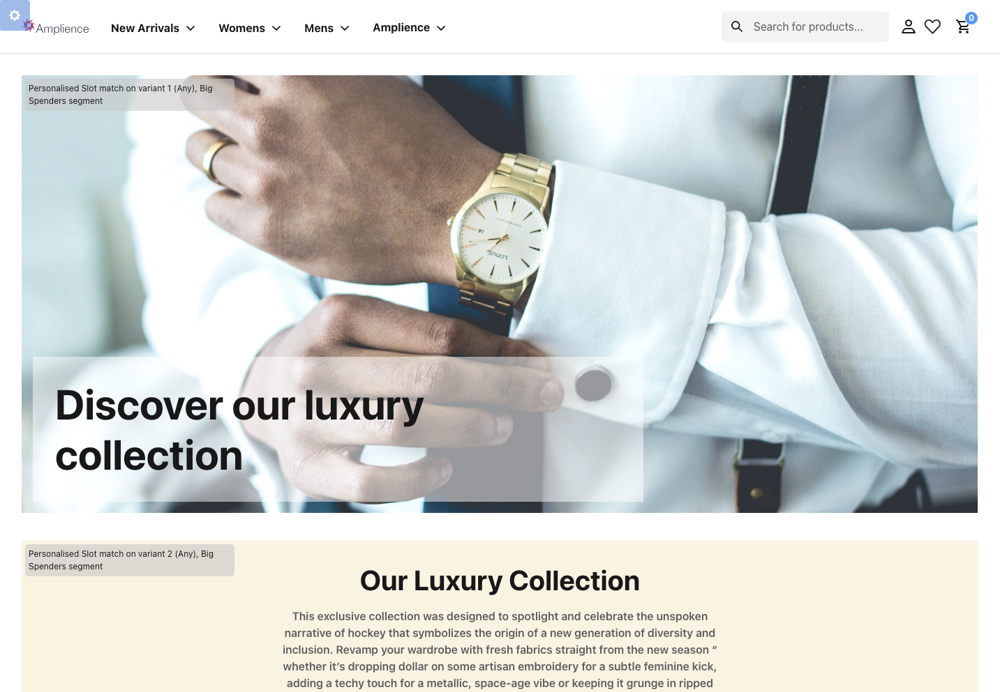
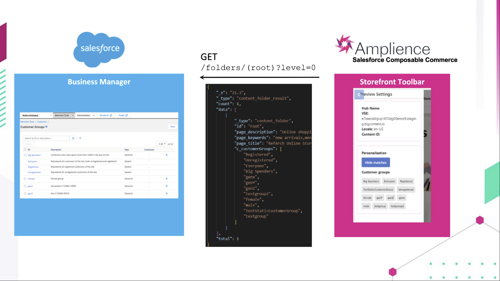
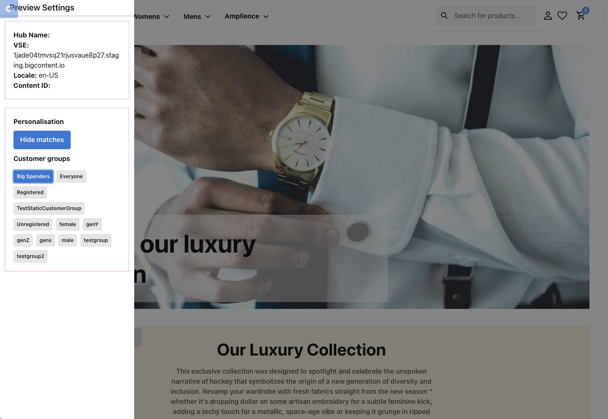
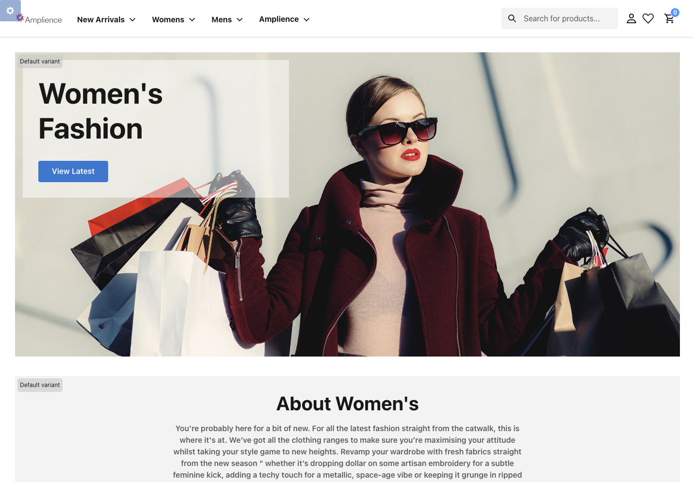
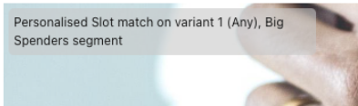
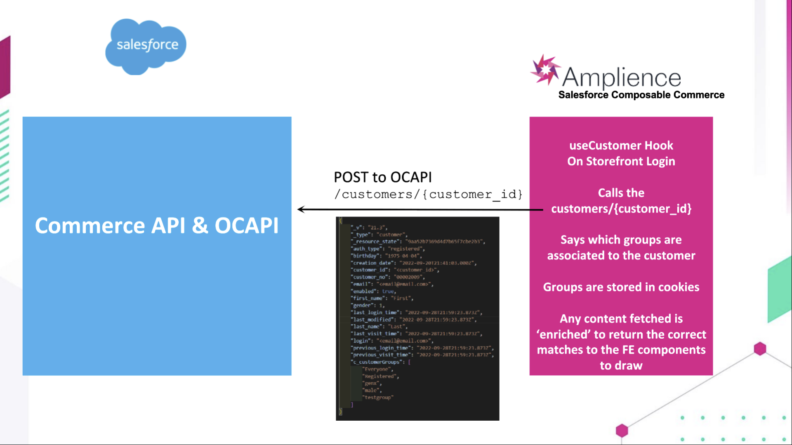
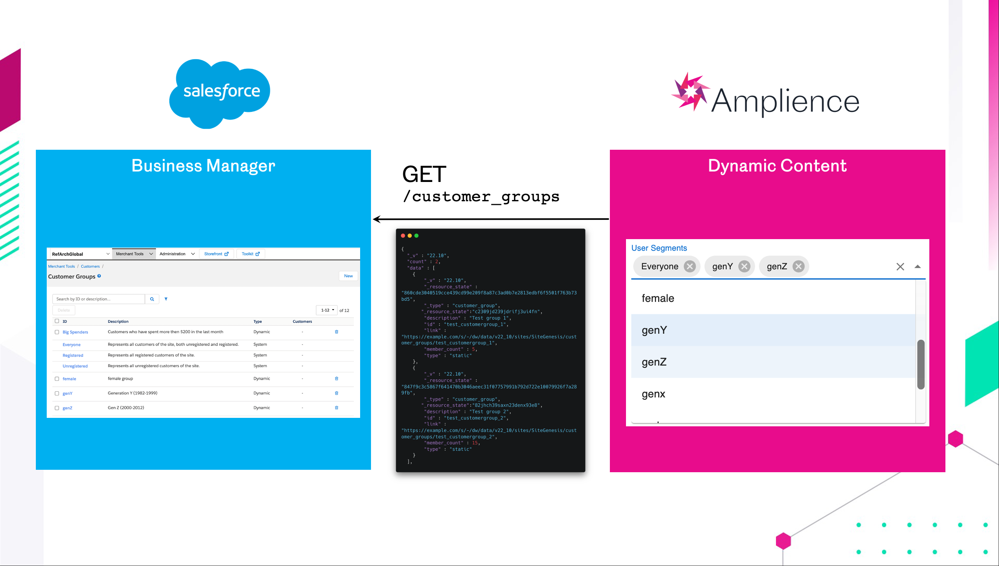

# Personalisation



Salesforce B2C Commerce has some powerful capabilties for personalisation. Typically this uses **Customer Groups**. Customers can be assigned to one or many static customer groups as well as dynamic customer groups.

In a headless storefront we can use the same concepts but there are architectural differences as Salesforce is no longer responsible for delivering content and experiences onto the page.

## Hooks Setup

In order for personalised content to fully work you'll need to install our [Amplience Hooks Cartridge](https://github.com/amplience/amplience-sfcc-hooksbridge) into your SFCC instance(s). There are detailed instructions there on how to install and add it to your cartrdge path. 

## Headless roles

In a headless storefront, teams are no longer required to work with a rigid structure for personalisation.

### Salesforce:
Is the single source of truth for customers and customer groups.
The API is the source to:
- list customer groups for selection
- authenticate a user and determine which customer groups they are assigned to.

### Amplience:
Amplience acts as the place where business teams curate and manage personalised experiences. Content variations are associated to customer groups.

### Composable Storefront (FE):
The front end is where the the API's are called from Amplience and Salesforce in order to display the right content variations to the customer.

## Personalisation approach

All content types that support personalisation have a few mandatory fields which define what content is selected for a given user.

- **Default Content:** This is a content link and can be a list of any content. This content is displayed when no customer group matches are made.
- **Content Variations:** Each variation can be assigned to one or many customer groups. Each variation also has a list of content. This list can be a reference so content for a variation is only fetched if it matches the current user. Result content is ordered by their variant's order of appearance.
- **Max Number of Matches:** Defines the maximum number of matched content items that can be displayed. Content items past the limit (in order of variation appearance) will be silently removed. 
For example, if your max matches is 2 AND if you are a user matching 3 groups that contain 20 variants, only the first 2 variant matches will be displayed.

## New Components/Slots

There are several new content schemas and types that allow for personalised content outlined below.

### Personalized Component

A ***single*** piece of personalised content that accepts any component defined in the `all-definitions#/definitions/anyComponent` schema partial. 

- **Default** content is a content link -- the content data is loaded on first fetch. 
- **Variant** content is an `Array` of Content References -- the content is loaded via reference ID ***after*** determining the customer's group
- **maxNumberMatches** - to define how many Content Variants a qualifying custimer will see

### Personalised In-Grid Container

Just like the Personalised Component, but only allowing content for a Product List Grid. A ***single*** piece of personalised content that accepts any component defined in the `all-definitions#/definitions/anyComponent` schema partial. 

- **Default** content is a content link -- the content data is loaded on first fetch. 
- **Variant** content is an `Array` of Content References -- the content is loaded via reference ID ***after*** determining the customer's group
- **maxNumberMatches** - to define how many Content Variants a qualifying custimer will see

### Personalized Container

A ***list*** of personalised content that accepts any component defined in the `all-definitions#/definitions/anyComponent` schema partial.

- **Default** content is an `Array` of content links -- the content data is loaded on first fetch. 
- **Variant** content is an `Array` of Content References -- the content is loaded via reference ID ***after*** determining the customer's group
- **maxNumberMatches** - to define how many Content Variants a qualifying custimer will see

### Personalized Slot Container

A ***list*** of personalised content with a **Delivery Key** that accepts any component defined in the `all-definitions#/definitions/anyComponent` schema partial.

- **Delivery Key** - Container may be fetched with `AmplienceWrapper` using the key you've entered
- **Default** content is an `Array` of content links -- the content data is loaded on first fetch. 
- **Variant** content is an `Array` of Content Links -- ***the content data is loaded on first fetch***
- **maxNumberMatches** - to define how many Content Variants a qualifying custimer will see

## Toolbar Enhancements

In addition to the preview features of the Toolbar, we've also incorporated the ability to preview your site content based on selected user group(s). In order to get all the customers groups on a site we first make a call to an OCAPI endpoint we've extended with a hook:



In order for this part of the toolbar to work you'll also need to install our [Amplience Hooks Bridge](https://github.com/amplience/amplience-sfcc-hooksbridge) cartridge in your SFCC envrionment. When installed your preview toolbar should include all your site's customer groups. Below is an example of what it will look like. 



The default view will show you the default content variant with some visual feedback on the content itself:



By Selecting one or more groups you'll see exactly what type of user matches the group selections:


Zoom Detail:



Each piece of content will indicate the number of matches based on groups


## Technical Behaviour

When content is then fetched, it is scanned using a generalized "enrich" method that looks for certain patterns, then runs handlers to enrich that data. The combination of pattern and handler is called an "Enrich Strategy", and one is enabled by default for personalised content.

This enrich strategy searches for the appearance of personalised containers, and then either filters existing content or fetches it based on the groups currently assigned to the content client. This content then replaces the `content` property of the container, so that it can be rendered directly. The matching variants are also placed into `variants` with their content embedded, if you wish to see all matching variants separately.

Because this runs on any fetch, it can be used seamlessly for fetches on the server and client side, and the content will be available without triggering any extra reflows. Our implementation of Real-Time Visualization also runs the default enrich methods, so personalised content is updated in real time as you change it in the content form.

We would recommend that any sensitive personalised content is fetched server-side.

In addition, because we've structured content variants as references in our schemas, content will not be exposed ***UNLESS*** a user is in fact 'allowed' to view it, i.e., they are part of a targeted user segment.


### Fetching groups and passing through the application

Active customer groups are primarily stored on cookies, so that the serverside renderer can use them when initially navigating to a page. Cookies from the client are initially read in `_app`, then passed through as props to the `AmplienceContext` and the Amplience content clients from there.

When the site is first loaded, the customer will be a guest as they are not logged. In this case the default content of any personalised content will be visible.

When the customer logs in or creates an account, we make an OCAPI call to `customer/{customer_id}` which we've enhanced with a hook (that hook can be found and included in your setup [here](https://github.com/amplience/amplience-sfcc-hooksbridge))



The groups are then saved into cookies, and the current page is soft reloaded. This is done by triggering a navigation to the current page, and setting a flag to make sure its `shouldGetProps` method returns true to force a refetch of any content obtained in getProps. The groups are changed on the default client and `AmplienceContext` directly so that content can be fetched with the new groups without doing a full reload.

### Authoring - Listing customer groups for selection
In order to list customer groups for a user to select, we need to get a list of available customer groups from Salesforce via the Open Commerce API.

Endpoint: `/customer_groups`

Documentation: [CustomerGroups resource (Data API)](https://documentation.b2c.commercecloud.salesforce.com/DOC2/index.jsp?topic=%2Fcom.demandware.dochelp%2Fcontent%2Fb2c_commerce%2Ftopics%2Fcustomers%2Fb2c_creating_a_customer_group.html)



The eComm Toolkit Extension calls the customer groups enpoint to retrieve the list for user selection.

The selected customer groups are then stored in the content so thqt they can be used, filtered, referenced for decision making.

```json
"segment": [
    "Everyone",
    "genY",
    "genZ"
]
```


