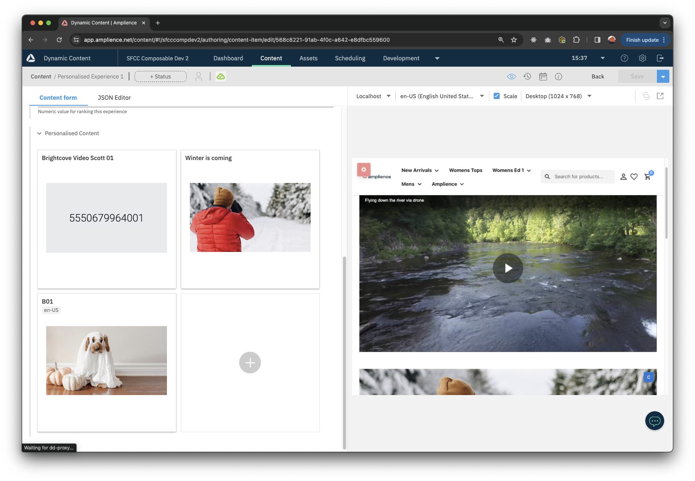
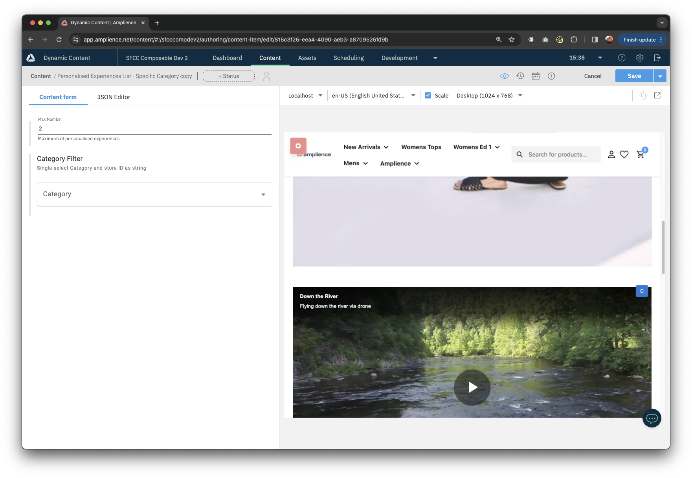

# Personalised Experiences

Using the personalised experiences feature, you can dynamically display ordered content for specific user segments.
You can also optionnaly display content for a specific category. Under the hood, the Filter API is used to filter personalised experiences based on segment and optionnaly category.

## Personalised Experience type



You can create as many Personalised Experiences as you want.
Each Personalised Experience contains the following:
- an active flag, used to filter our experiences globally
- one segment, selected using the eCommerce Toolkit extension
- one optional category, also selected using the eCommerce Toolkit extension
- a ranking, the higher the ranking, the higher priority it will be
- an array of Content Items to be displayed

## Personalised Experiences List type



Once you have defined your various Personalised Experiences, you can display them in your pages using Personalised Experiences Lists.
A Personalised Experiences List contains the following:
- the maximum number of experiences to display
- an optional Category used to filter experiences
Groups from the logged in user will be used in the filter by query.
If no group is found, the default group `Everyone` will be used for the query.
Experiences will be displayed using descending ranking values.

## Filter API
Personalised Experiences are using:
- a sortable trait - ranking (descending)
- sort by paths:
    - active, segment
    - active, segment, category

Traits in Personalised Experience schema:

```json
"trait:sortable": {
    "sortBy": [
        {
            "key": "default",
            "paths": ["/ranking"]
        }
    ]
},

"trait:filterable": {
    "filterBy": [
        {
            "paths": [
                "/active",
                "/segment"
            ]
        },
        {
            "paths": [
                "/active",
                "/segment",
                "/category"
            ]
        }
    ]
}
```
