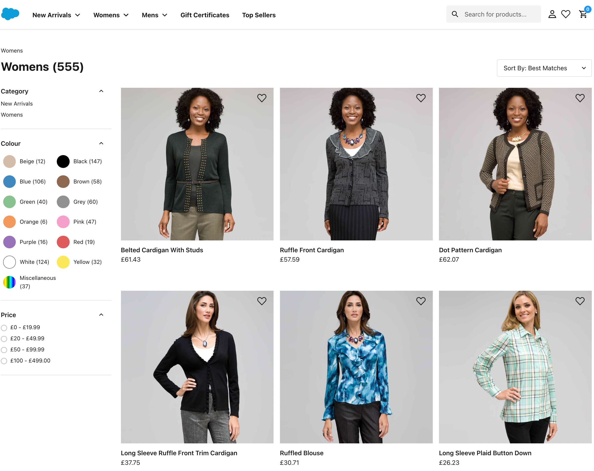

# Product Listing Page (PLP) management

Blurb about what the PLP is

## Key differences

### Default from SFCC Composable
The out of the box SFCC Composable Storefront from Salesforce does not allow any confiiguration for a PLP by the user. It is fixed to display a list of products and related facets by a product category.



### With Amplience

Amplience allows you to manage content for your PLP in a number of ways:
* Top Content - Choose a list of content / slots to display at the top of your PLP
* Bottom Content - Choose a list of content / slots to display a the bottom of your PLP
* In Grid Content - Choose content to display in the product grid. You can define the size in columns and rows as well as the order


## Global Architecture choices

### Content references
As the same content is used to draw the navigation, we wanted to ensure that we don't over populate the data to draw any pages. Therefore any content in the category page node is provided as a **content-reference** instead of a **content-link** to ensure that the payload is as small as possible but the application knows what content to fetch.

[More information about content links and references](https://amplience.com/docs/integration/choosers.html#linksandreferences)

### Fetching content references
Where we have multiple content references to fetch Server Side, we combine them into a multiple fetch. So instead of 12 references having 12 calls we combine them into one.

[More information about multi-fetch API](https://amplience.com/docs/development/contentdelivery/readme.html#multipleitems)

## Product Tile changes
For asthetics, we have changed the look of the default product tile on the PLP. If you would like to put back to the original you can follow the steps below:

1) Go to `app/pages/product-list/index.jsx`
2) Remove lines 57-59
```javascript
// TO switch back to the OOTB Product Tile, comment the next 2 line out and uncomment line 46 above
import AmplienceProductTile from '../../components/amplience/product-tile'
import {Skeleton as ProductTileSkeleton} from '../../components/amplience/product-tile'
```
2) Uncomment line 46
```javascript
//import ProductTile, {Skeleton as ProductTileSkeleton} from '../../components/product-tile'
```

## Top Content - Server Side Rendered method
As the top content is always above the visible fold, we fetch the data using Server Side rendering

```javascript
const rawTopContent = ampCategory?.topContent || []
const ids = rawTopContent.map(getIdsForContent)
const ampTopContent =
    ids && ids.length ? await ampClient.fetchContent(ids, {locale: targetLocale}) : []
```
We then render an Amplience Wrapper component passing through the content fetched:

```javascript
{ampTopContent &&
    _.compact(ampTopContent).map((content, ind) => (
        <AmplienceWrapper key={ind} content={content}></AmplienceWrapper>
    ))
}
```

## Bottom Content - Client Side Rendered method
As the bottom content is typically below the visible fold, we already have the ID's from the content references and pass them to the AmplienceWrapper component to render for each reference:

```javascript
{ampBottomContent &&
    _.compact(ampBottomContent).map((content, ind) => (
        <AmplienceWrapper key={ind} fetch={{id: content.id}}></AmplienceWrapper>
    ))
}
```

## Specifics for Amplience Real Time Visualisation
Because we are using content references, real time visualisation changes only provide the content for the page we are currently in. Each time the model changes, we need to fetch the content references for the `topContent`.

```javascript
useAmpRtv(
    async (model) => {
        setAmpSlots(model.content?.gridItem)

        const childContentPromise = async () => {
            if (!model.content.topContent) return []
            const topContentIDs = model.content?.topContent.map(getIdsForContent) || []
            if (topContentIDs && topContentIDs.length) {
                const rtvTopContent = await defaultAmpClient.fetchContent(topContentIDs, {
                    locale: locale + ',*'
                })
                return rtvTopContent
            } else {
                return []
            }
        }
        const dataForTopContent = await childContentPromise()
        setAmpTopContent(dataForTopContent)
        setAmpBottomContent(model.content.bottomContent)
    },
    undefined,
    [initialAmpSlots, initialAmpBottomContent, initialAmpTopContent]
)
```

## Rules for displaying in grid content
As we are enriching the product list content with content, we need rules to display the content as the order and quantity of products may change. Plus sizes (columns and rows) for desktop are not valid for mobile:

* In-Grid content should not overwrite products, they should be moved aside.
* Ensure the search with/without the in-grid content have the same products.
* Products should wrap to the next page at an earlier point when in-grid content is present, but it should not skip any.
* In-Grid content positions should have 24 slots per page. For example, content at 25 should appear at the start of the 2nd page, 50 at the 3rd, etc.
* Mobile size should force all in-grid content to be 1x1, and it should recover when resizing to desktop.
* It should reload the page if the page offset is not valid relative to the content.
* It’s possible to place invalid grid tiles since we can’t place constraints on the values. Follow these rules when testing:
    * Pages start at multiples of 25 from the first result.
    * Lines start at multiples of 3 from the start of the page. (2 for desktop)* 2-column content should only be placed at the start or middle of a line (for example, position 2 is not allowed)
    * 3-column content should only be placed at the start of a line. (page base + multiple of 3)
* I can put the same content in multiple times.