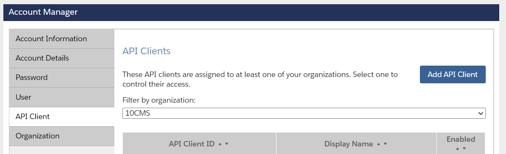
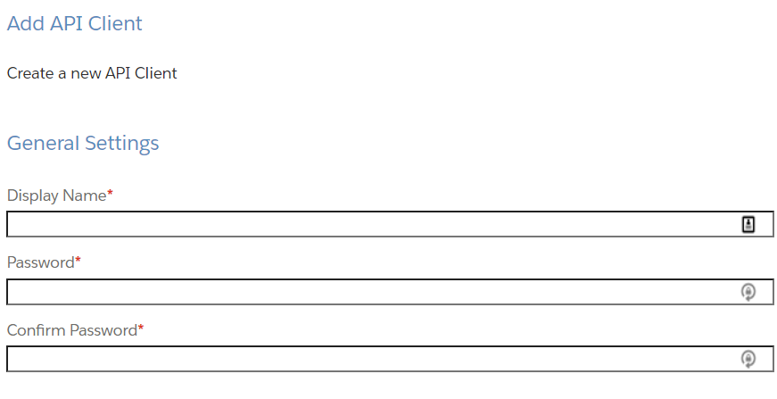

# Salesforce Commerce Cloud Setup

In addition to the base level setup required to run the Salesforce Composable Commerce Front End which can be found here:

[SFCC - Getting Started with Progressive Web App Kit](https://developer.salesforce.com/docs/commerce/pwa-kit-managed-runtime/guide/getting-started.html#new-project)

Amplience also interfaces with Salesforce Commerce Cloud APIs in order to provide a seamless visual management experience on the front end. This includes things like:
* Browsing, selecting and rendering individual products
* Browsing, selecting and rendering categories to draw products and Product Listing Pages
* For Content Personalisation, fetching a Site's User Groups & the User Groups a logged in customer belongs to 

When you're ready to start pointing to your own SFCC On-Demand Sandbox, there are four main things you’ll need to have ready for/on your ODS. 

* A [Client ID & Secret](#client-id-and-secret) 
* The [OCAPI Configuration](#ocapi-configuration) in your ODS Business Manager
* To enable **Content Personalisation**, install our [Amplience Hooks Bridge Cartridge](https://github.com/amplience/amplience-sfcc-hooksbridge) on your ODS (detailed instructions at the [Amplience Hooks Bridge Cartridge](https://github.com/amplience/amplience-sfcc-hooksbridge) page)
* [Localisation](#localisation). 

All are outlined below, while instructions for installing our OCAPI hooks cartridge can be found [here](https://github.com/amplience/amplience-sfcc-hooksbridge))

## Client ID and Secret

>***NOTE***: If you have already done this during your main SFCC setup, skip to the [OCAPI section](#ocapi-configuration).

In order to setup a Client ID and Secret, you’ll need Admin Rights in SFCC Account Manager. IF you don’t have this access, contact your account admin. 

1. Sign in to Account Manager
2. Then click “API Client” and the “Add API Client” button



3. Enter a description and a Password. The password will be your secret, so don’t forget it. But if you do, can just reset it.



4. Click “Save” at the bottom of the page, you’ll then see your newly created Client ID 🎉🎉🎉

## OCAPI Configuration
Now that you have your Client ID and Secret, you can configure OCAPI access on your ODS. Login to your ODS, then goto `Administration > Site Development > Open Commerce API Settings`. 

You’ll need to configure access for both Shop & Data endpoints:


### Shop Settings

```json
{
    "client_id": "{THIS IS YOUR CLIENT ID}",
    "allowed_origins": [
        "https://ecomm-toolkit.extensions.content.amplience.net"
    ],
    "resources": [
        {
            "resource_id": "/customers/*",
            "methods": [
                "get",
                "patch",
                "post"
            ],
            "read_attributes": "(**)",
            "write_attributes": "(**)"
        },
        {
            "methods": [
                "get"
            ],
            "read_attributes": "(**)",
            "write_attributes": "(**)",
            "resource_id": "/product_search"
        },
        {
            "methods": [
                "get"
            ],
            "read_attributes": "(**)",
            "write_attributes": "(**)",
            "resource_id": "/products/{id}"
        },{
            "methods": [
                "get"
            ],
            "read_attributes": "(**)",
            "write_attributes": "(**)",
            "resource_id": "/categories/{id}"
        }
    ]
}
```

### Data Settings

```json
{
    "client_id": "{THIS IS YOUR CLIENT ID}",
    "allowed_origins": [
        "https://ecomm-toolkit.extensions.content.amplience.net"
    ],
    "resources": [
        {
            "methods": [
                "post"
            ],
            "read_attributes": "(**)",
            "write_attributes": "(**)",
            "resource_id": "/product_search"
        },
        {
            "methods": [
                "get"
            ],
            "read_attributes": "(**)",
            "resource_id": "/sites/{site_id}/customer_groups"
        }
    ]
}
```

## Localisation
If you are pointing to your own SFCC ODS (On-demand Sandbox), you’ll need to setup localization in both your SFCC ODS and your FE Application.

To get you started, we’ve setup a few things in this reference application itself. In the `config/sites.js`, we've set the URL pattern to path and showDefaults to true. We’ve also configured `en-US`, `fr-FR`, `de-DE`, `es-ES`, and `it-IT` in the `config/sites.js` file. There are more notes on localisation for ASCC specifically [here](/app/translations/README.md).

In addition to the Amplience SF FE configs, your ODS will also need to have locales setup and enabled for the site you are pointing to, and they **MUST MATCH** the locales setup in `config/sites.js` Setting up locales on your SFCC ODS is well documented in the [SFCC B2C Info Center](https://documentation.b2c.commercecloud.salesforce.com/DOC2/index.jsp?topic=%2Fcom.demandware.dochelp%2Fcontent%2Fb2c_commerce%2Ftopics%2Fadmin%2Fb2c_configuring_site_locales.html)

> Note: if pointing to your own SFCC instance with a localized OOTB site (`RefArchGlobal`), de-DE won’t have translations even if that locale has been setup in Business Manager
