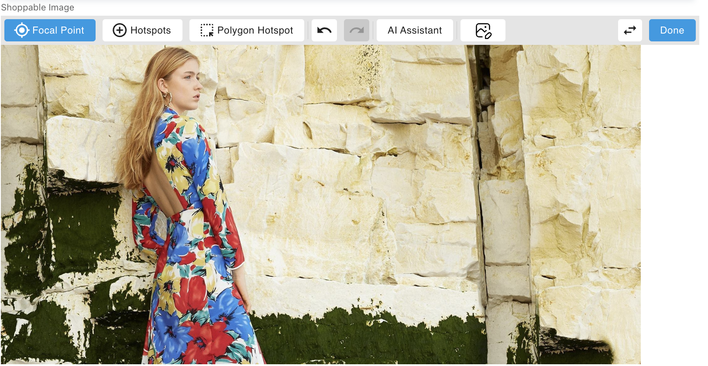
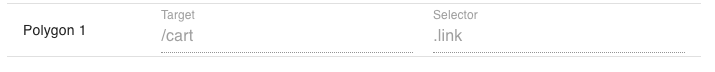

# Shoppable Image Component & Extension

The Shoppable Image component & extension allows you to tie hotspots and regions on an image to links, tooltips and popups by setting `targets` and `selectors`. The `selector` defines the ***type*** of content, and the `target` defines the ***specific content***.

| selector  | target    | example   | description   | 
| --------  | ------    | -------   | -----------   |
| **product** | Product ID | `78916783M` | Links to an SFCC product by ID. On hover, will show the product name and price.|
| **category** | Category ID | `newarrivals-women` | Links to an SFCC category by ID. On hover, will show the category name. |
| **link** | relative/absolute URL | `/cart`, `https://amplience.com` | A link to any URL. Can be relative or absolute. On hover, will show the target text. We recommend setting a custom tooltip. |
| **page** | Delivery Key | `faq` | Links to an Amplience content page. On hover will display the target text, we recommend setting a custom tooltip. |
| **tooltip** | Tooltip Key | `tooltip-key` | A tooltip that does nothing on click. |
| **contentKey** | Delivery Key | `hero` | Opens a drawer displaying Amplience content with the specified key. On Hover, will show the text "Click to Open..." |

## Tooltips
For any selector, you can define a custom localised tooltip using the array below that overrides the default one. The key of the tooltip should match whatever the target is in the shoppable image, and the value is what you want to appear in the tooltip. The tooltip selector will only display a tooltip if the text is defined here.

## Editing Mode

Once you've selected your image, enter Edit mode by clicking the pencil icon as shown:

As you start to add Focal Point and HotSpots, they will appear on the image where you've placed them, as well as in list form BELOW your image, where you may set `selector` & `target` options.

## Setting Image Focal Point

To Add or edit the image focal point, make sure you've clicked the 'Focal Point' button, You'll see a translucent square and circle indicator. Drag the indicator to where you'd like to pull focus.

### Deleting Focal Point

To delete the focal point, click the trash icon in the Focal point line below the image:

> NOTE: If you don't set a focal point, the whole image will be shown but with white space around to so that it's centred.

## Setting Hotspots & Polygon Areas

To set a hotspot, click the 'HotSpot' icon while in Edit mode, then click to place a new hotspot, or drag an existing one:

To Add a Polygon hotspot, click 'Polygon Hotspot, choose rectangle or circle,

Then click and drag to create your shape exactly where you want it. You can re-size and move your shape at any time if you don't get it right the first time.

## Setting Selectors & Targets

Below are some examples of hotspot selectors and targets.

## Setting Tooltips

Except for `tooltip` type hotspots, which ***MUST*** have a custom tooltip, there's a few examples where setting custom tooltips make a lot of sense. Let's take the example where you might want to link to the cart page from your hotspot:

When you hover over the the bowtie hotspot, the tooltip will simply read "/cart", which is not very user friendly. This is a case where you'd want to set a custom tooltip. In the Tooltip section click the "Add Tooltip" button and set the key to `/cart`, which exactly matches the **target** of that hotspot, and then set any text you'd like.

Now when you hover over that spot it will read the text you've entered. This text may also be localised.

## Realtime Visualisation

As with all of our Amplience components, all your changes are ready to view in realtime as you're building a Shoppable Image, so there's no guessing what it's going to look like or what the shopper's experience will be.

