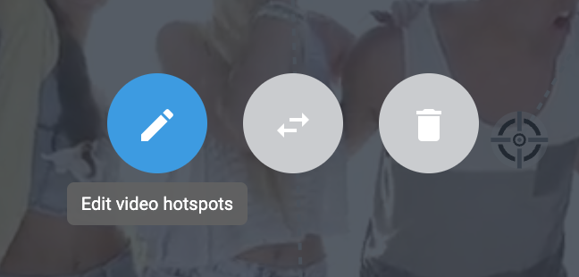
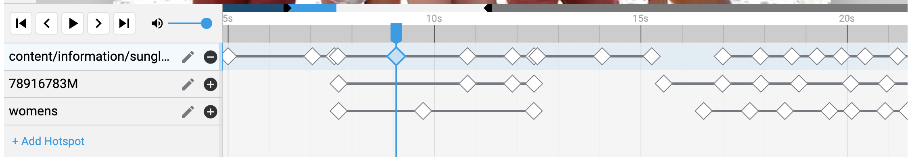
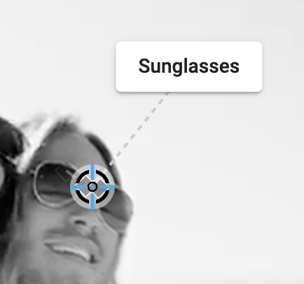
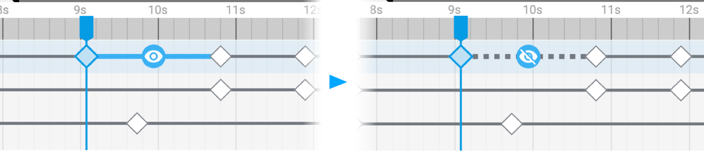
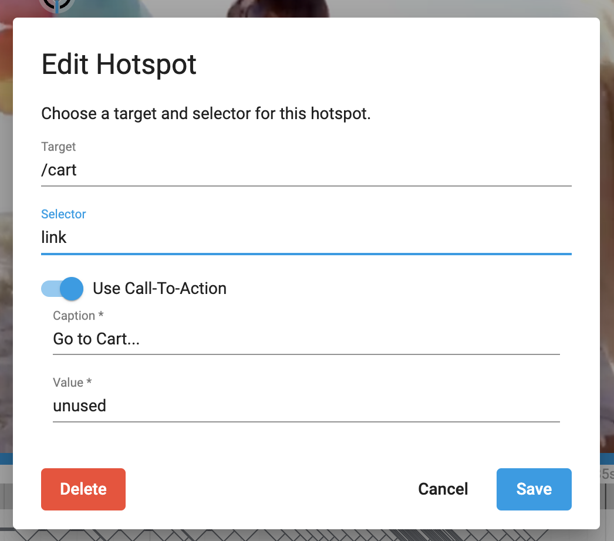
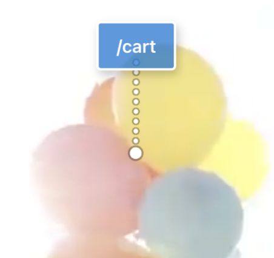
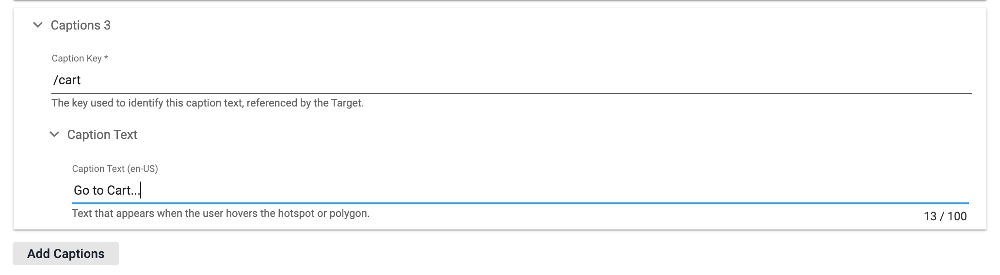
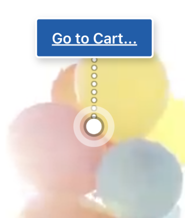
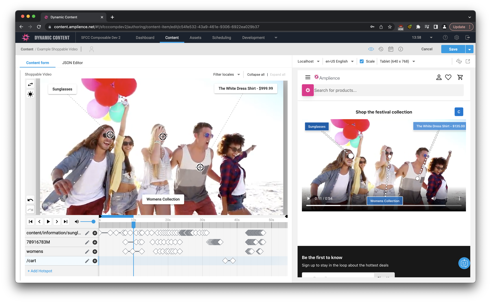

# Shoppable Video Component & Extension

The Shoppable Video component & extension allows you to enrich a video with moving interactive hotspots, and associated call-to-action buttons that can be clicked as the video plays.

These interactive elements links, captions and popups by setting `targets` and `selectors`. The `selector` defines the ***type*** of content, and the `target` defines the ***specific content***.

| selector  | target    | example   | description   | 
| --------  | ------    | -------   | -----------   |
| **product** | Product ID | `78916783M` | Links to an SFCC product by ID. On hover, will show the product name and price.|
| **category** | Category ID | `newarrivals-women` | Links to an SFCC category by ID. On hover, will show the category name. |
| **link** | relative/absolute URL | `/cart`, `https://amplience.com` | A link to any URL. Can be relative or absolute. On hover, will show the target text. We recommend setting a custom caption. |
| **page** | Delivery Key | `faq` | Links to an amplience content page. On hover will display the target text, we recommend setting a custom caption. |
| **tooltip** | Tooltip Key | `tooltip-key` | A caption that does nothing on click. |
| **contentKey** | Delivery Key | `hero` | Opens a drawer displaying amplience content with the specified key. On Hover, will show the text "Click to Open..." |

## Keyframes
For each interactive element you add (hotspot), you will have a new row in the timeline timeline. You can add multiple keyframes for each hotspot and position the elements on the screen.

## Captions
For any selector, you can define a custom localized caption using the array below that overrides the default one. The `key` of the caption should match whatever the `target` is in the shoppable video, and the value is what you want to appear in the caption. The `tooltip` selector will only display a caption if the text is defined here.

## Editing Mode

Once you've selected your video, enter Edit mode by clicking the pencil icon as shown:

You can add a hotspot to your video by clicking the "Add Hotspot" button. A prompt will appear to ask for a target/selector, and if you want a CTA to appear. You should always set the CTA to appear, then use anything you want for the caption and value, as they are replaced based on your target/selector and captions list. See above for more information on targets and selectors, or reference the built-in docs above the extension.

As you start to add hotspots, they will appear on the timeline, where you can select them to start placing on top of the video. Clicking anywhere on the video when a hotspot is selected will add a keyframe for that hotspot at the current time in the video. Create keyframes at different points in the video, and the hotspot will move through them as it plays. Play back the video using the controls to see how it will move. 

## Hotspot Keyframe Basics

The best way to track a product through a video is to start when it becomes visible. Select your new hotspot, find this point, then click on the video where you want the hotspot to appear. After this, you'll want to track the movement of your hotspot by scrolling through the video and dragging the keyframe to the correct position. Do this as many times as necessary to track the object movement. You can easily add keyframes between existing ones by going to a time between them, then dragging it to a new position.

If you want to reposition a hotspot keyframe, click on it in the timeline to move to it first, then drag it around. You can also drag keyframes within the timeline if you want to slightly adjust their timing.

If you need more fine grained control, you can zoom in on the timeline using ctrl+mouse wheel or a trackpad gesture, then click + drag through it to pan. You can advance between frames of the video by pressing `,` (prev) and `.` (next).

## CTA Position

The Call to Action (CTA) button is where your caption for the target will display. It stays static during any period of time the hotspot is visible, so that it can easily be clicked or tapped without the user missing the button due to movement. You should place the button at a position that doesn't overlap your hotspot at any point, and is generally at an equal distance to each point in the motion to avoid the connecting line being too long.

To move a hotspot, click and drag the button anywhere over the video. Take note of how the hotspot looks in the visualization, as it will render slightly differently.

## Temporarily Hiding Hotspots

By default, hotspots are visible in the time between their first keyframe and the last one. If you want the hotspot to disappear and then reappear later, then mouse over the line between two keyframes where you want the hotspot to become invisible, and click it. The line will disappear when you've removed its visibility. You can click the space between the two keyframes to make it visible again.

These are useful for camera changes (make the target point disappear momentarily while the camera changes), when the target goes offscreen or when it is occluded, without needing to create another identical hotspot. The CTA can also be repositioned when a hotspot hides and reappears, so hiding is useful if you want to move it.

## Setting Captions

Except for `tooltip` type hotspots, which ***MUST*** have a custom caption, there's a few examples where setting custom captions make a lot of sense. Let's take the example where you might want to link to the cart page from your hotspot:

When the hotspot appears in the video the CTA button will simply read "/cart", which is not very user friendly. This is a case where you'd want to set a custom caption. In the Caption section click the "Add Caption" button and set the key to `/cart`, which exactly matches the **target** of that hotspot, and then set any text you'd like.

Now the CTA button will read the text you've entered. This text may also be localised.

## Realtime Visualisation

As with all of our amplience components, all your changes are ready to view in realtime as you're building a Shoppable Video, so there's no guessing what it's going to look like or what the shopper's experience will be.

## General usage documentation
For further details about the extension for shoppable video, please see the extension page directly:
- [Shoppable Video Overview](https://github.com/amplience/dc-extension-shoppable-video/blob/main/README.md)
- [Shoppable Video Format & Usage](https://github.com/amplience/dc-extension-shoppable-video/blob/main/docs/FORMAT-USAGE.md)
