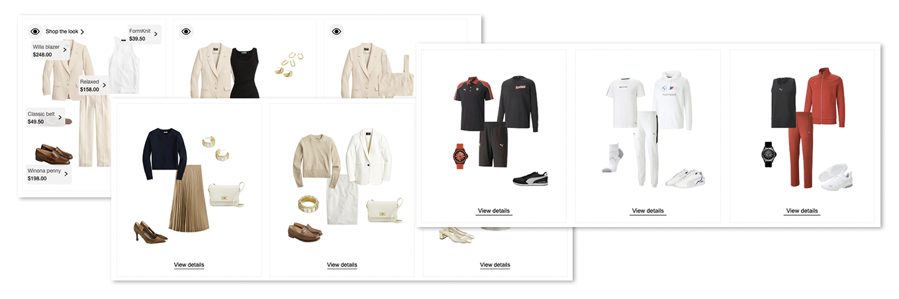

# Stylitics Components

Uses the [Amplience Stylitics Integration (see link for full documentation)](https://github.com/amplience/dc-integration-stylitics) to render Stylitics widgets as a component. Stylitics and Amplience are a great fit for our creating automated shoppable experience using the great capabilities of Stylitics to increase AOV and basket size.

## Key implementation areas
* Sample product set that can be used when selecting products (see [documentation](https://github.com/amplience/dc-integration-middleware/blob/main/docs/vendor/commerce/rest.md))
* All of the components for available Stylitics Widgets and implementation

## Key Demonstration areas
* Configuring Stylitics as a component like any other to place in your experience (content, slots)
* Use of Stylitics In Grid for category pages (note: rendering is by the Stylitics widgets. Would recommend full width placements)
* Personalisation examples like any other content
* Shoppable Video examples (load Stylitics widgets in a sidebar)
* Product Page content

> Note: This demonstration uses Stylitics widgets which render into the front-end. Whilst suitable for a demo, these widgets do are not completely responsive. Noticeably when demonstrating Stylitics widgets in the product grid for category pages. At smaller screen resolutions and other sizing you may see that the widget does not contain in the grid properly (screenshot below). As a demo we recommend checking sizing first and where applicable making maximum grid sizing. In an implementation you might want to make your own React component using the Stylitics API's directly or a click path to open in a drawer.

## Customising for your implementation
This automation points to a sample Stylitics data set and account. If you are using in your own implementation as a sample and wanted to change anything, full details can be found here: 

https://github.com/amplience/dc-integration-stylitics/blob/main/docs/automation.md#customisations--implementation

Files can be found in `/amplience-automation/automation-files`

## Automation specifics
We would recommend that you upload and overwrite any media in your content hub before this release. Automation documentation can be seen [here](./automation.md#media)

> Note: Stylitics do not currently have any demo data sets for the SFCC default catalog, so we have implemented a product selector that points to a demo data set. This means that any links are as per Stylitics demo data. This may change in future releases.
