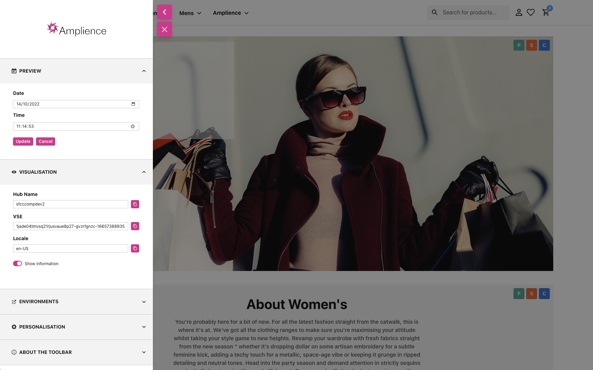

# Toolbar Framework



The Amplience Toolbar allows you to easily navigate preview and visualisation using the different panels available.

## Standard Panels

### Preview Panel

The Preview Panel allows you to do time travel in your events and editions.

### Visualisation Panel

The Visualisation Panel shows the current visualisation parameters such as VSE, hub name, locale and content ID. You can easily copy/paste any of these value using the copy icon.

### Environments Panel

The Environments Panel allows you to switch from your default environment to additional ones (for instance UAT, Test, etc.).

### Personalisation Panel

The Personalisation Panel allows you to show personalisation rules match, and simulate customer groups to test your rules.

### About Panel 

The About Panel displays some help (Content Managed) and allows you to change the Toolbar Opacity.

## How to add a new Toolbar Panel

### List of Toolbar Panels

The list of Toolbar Panels is stored in the `app/components/amplience/toolbar/index.jsx` file, in an `items` array. You can define the panel title, icon if any, Panel component and visibility:

```js
const items = [
        {
            title: formatMessage({
                defaultMessage:
                    'Preview',
                id: 'toolbar.title.preview'
            }),
            Icon: CalendarIcon,
            Component: PreviewPanel,
            visibility: ({vseTimestamp}) => !!vseTimestamp
        },
        ...
]
```
You can create your own panel and add it to the list. Standard panels are stored in `app/components/amplience/toolbar` sub-folders.

### Visibility Function

You can control the visibility of each Toolbar Panel using a `visibility` function in the list of panels. For instance, the Preview Panel only appears if `vseTimestamp` exists: 

```js
visibility: ({vseTimestamp}) => !!vseTimestamp
```

### Toolbar State

Toolbar is saving its state in `openedPanels` and `toolbarOpacity` so it appears correctly when the Toolbar is closed / re-opened. You can also pass some global intial state passed to all Toolbar Panels using `toolbarState`.

### Toolbar Panel Renderer

The renderer for each Panel is using the `AccordionItem` component from Chakra UI.

```xml
<AccordionItem {...styles.section}>
    <AccordionButton
        onClick={onClick}
        {...styles.button}>
        <Box flex="1" textAlign="left" {...styles.sectionTitle}>
            <Heading as="h2" size="xs">
                <HStack>
                    {Icon && <Icon />}
                    <Text casing="uppercase">{title}</Text>
                </HStack>
            </Heading>
        </Box>
        <AccordionIcon />
    </AccordionButton>
    <AccordionPanel {...styles.pannel}>
        <Component {...otherProps} />
    </AccordionPanel>
</AccordionItem>
```