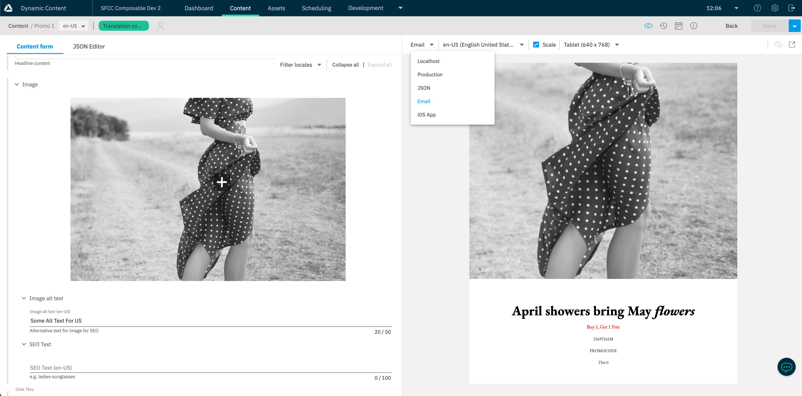
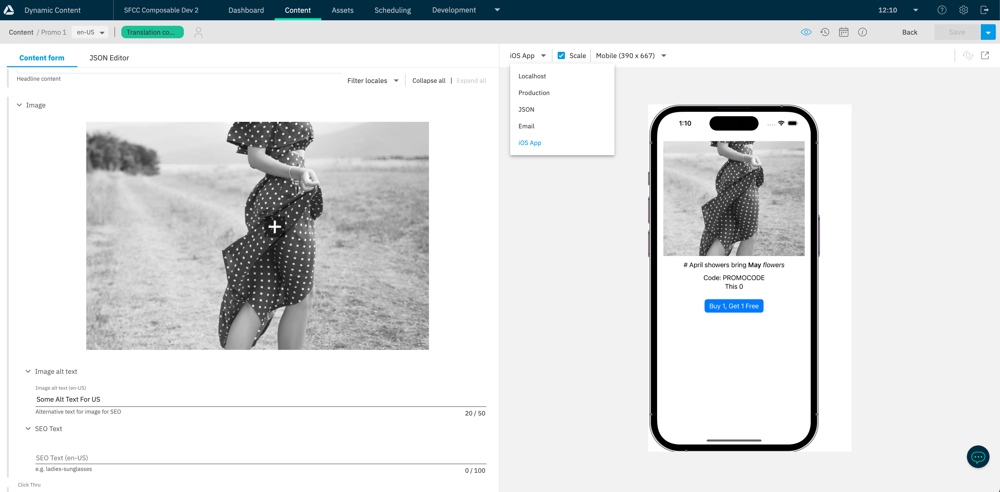

# Visualisation (Real time)

One of the advantages of using Amplience is that it is the only headless CMS for commerce that ensures that you can see what you are editing. 

## Setting up a specific visualisation route

As the components can be in any location, we have set up a specific Visualisation route which is used to visualise individual content items as you are editing.

This route is added to the Visualisations in your Amplience Content Type.

Location: `app/routes.jsx`

Import:

``` js
const RealtimeVisualization = loadable(() => import('./pages/amplience/realtime-visualization'))
```

Additional Route:

``` js
{
  path: '/visualization/:hubname/:contentId',
  component: RealtimeVisualization,
  exact: false
}
```

This route is added to the Visualisations in your Amplience Content Type: `http://localhost:3000/{{locales}}/visualization/{{hub.name}}/{{content.sys.id}}?vse={{vse.domain}}`

## Real Time Visualisation

Real time visualisation uses the Amplience [Real Time visualisation SDK](https://github.com/amplience/dc-visualization-sdk) in order to load content and change props in your component in real time as you are editing.

Location: `app/pages/amplience/realtime-visualization/index.jsx`

# External Visualisations

As a Headless CMS, content can be used in multiple channels. Below are details of visualising content in multiple channels. 

## Email Visualisation

Shows how content would look in an email template using our [Content Rendering Service](https://amplience.com/developers/docs/apis/content-rendering-service/).

Available as Visualisations for the following content types:

* Promo
* Promo Bynder
* Banner
* Banner Bynder



## iOS

Shows how content would look on a native iOS app using the [Amplience iOS SDK](https://github.com/amplience/dc-delivery-sdk-ios) and uploaded to a third party service called [appetize.io](https://appetize.io/) for URL based app preview.

Available as visualisations for the following content types:

* Promo
* Promo Bynder
* Banner
* Banner Bynder

